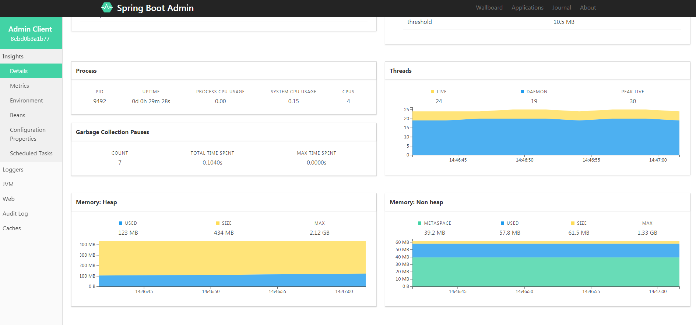

# spring-boot-demo-admin 可视化服务监控

## 示例主要内容

- spring-boot-admin-client快速配置
- spring-boot-admin-server快速配置
- spring-boot-admin主要内容介绍

## Spring Boot Admin介绍

Spring Boot Admin是一个开源社区项目，用于管理和监控SpringBoot应用程序。 应用程序作为Spring Boot Admin Client向为Spring Boot Admin Server注册（通过HTTP）或使用SpringCloud注册中心（例如Eureka，Consul）发现。 展示Spring Boot Admin Client的Actuator端点上的一些监控。Spring Boot Admin为注册的应用程序提供以下功能：

- 显示健康状况
- 显示详细信息，例如
- JVM和内存指标
- micrometer.io指标
- 数据源指标
- 缓存指标
- 显示构建信息编号
- 关注并下载日志文件
- 查看jvm system-和environment-properties
- 查看Spring Boot配置属性
- 支持Spring Cloud的postable / env-和/ refresh-endpoint
- 轻松的日志级管理
- 与JMX-beans交互
- 查看线程转储
- 查看http-traces
- 查看auditevents
- 查看http-endpoints
- 查看计划任务
- 查看和删除活动会话（使用spring-session）
- 查看Flyway / Liquibase数据库迁移
- 下载heapdump
- 状态变更通知（通过电子邮件，Slack，Hipchat，......）
- 状态更改的事件日志（非持久性）

## 配置spring-boot-admin-server

### 1.创建admin-server项目

### 2.pom.xml添加server依赖

```xml
    <dependencies>
        <dependency>
            <groupId>de.codecentric</groupId>
            <artifactId>spring-boot-admin-starter-server</artifactId>
            <version>2.1.6</version>
        </dependency>
        <dependency>
            <groupId>org.springframework.boot</groupId>
            <artifactId>spring-boot-starter-web</artifactId>
        </dependency>
    </dependencies>
```

### 3.application.properties配置端口

```properties
server.port=8000
```

### 4.启动类

```java
@Configuration
@EnableAutoConfiguration
@EnableAdminServer
public class AdminServerApplication {

    public static void main(String[] args) {
        SpringApplication.run(AdminServerApplication.class, args);
    }
}
```

### 5.运行项目

浏览器输入：http://localhost:8000/   即可打开监控管理界面了。

## 配置spring-boot-admin-client

### 1.创建admin-client项目

### 2.pom.xml添加client依赖

```xml
    <dependency>
        <groupId>de.codecentric</groupId>
        <artifactId>spring-boot-admin-starter-client</artifactId>
        <version>2.1.6</version>
    </dependency>
    <dependency>
        <groupId>org.springframework.boot</groupId>
        <artifactId>spring-boot-starter-web</artifactId>
    </dependency>
```

### 3.application.properties添加配置

```properties
server.port=8001
spring.application.name=Admin Client
spring.boot.admin.client.url=http://localhost:8000
# 设置端点暴露的哪些内容，默认["health","info"]，设置"*"代表暴露所有可访问的端点
management.endpoints.web.exposure.include=*
# 端点健康情况，默认值"never"，设置为"always"可以显示硬盘使用情况和线程情况
management.endpoint.health.show-details=always
```

### 4.运行项目

### 运行效果图



### 资料

- [示例代码-github](https://github.com/smltq/spring-boot-demo/blob/master/admin/README.md)
- [参考资料](http://www.ityouknow.com/springboot/2018/02/11/spring-boot-admin.html)
- [官方文档](https://codecentric.github.io/spring-boot-admin/1.5.0/#_what_is_spring_boot_admin)