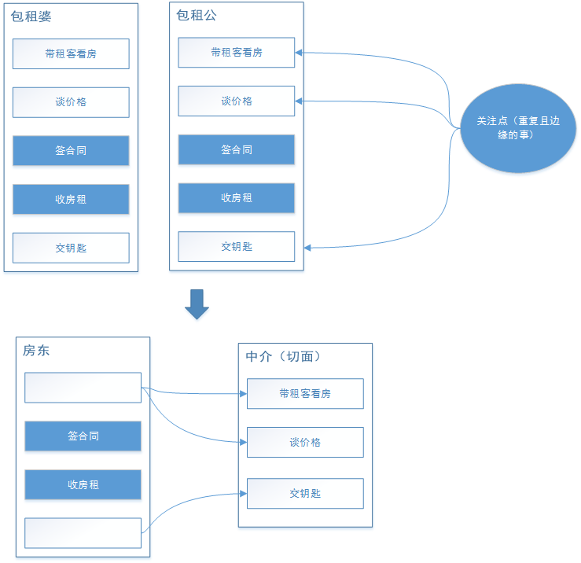

# Spring Boot AOP

面向方面编程（AOP）通过提供另一种思考程序结构的方式来补充面向对象编程（OOP）。
OOP中模块化的关键单元是类，而在AOP中，模块化单元是方面。

## AOP(Aspect Oriented Program) 面向切面编程

在面向切面编程的思想里面，把功能分为核心业务功能和周边功能。

- 核心业务，比如登陆，增加数据，删除数据都叫核心业务
- 周边功能，比如性能统计，日志，事务管理等等

周边功能在 Spring Boot 的面向切面编程AOP思想里，即被定义为切面
在面向切面编程AOP的思想里面，核心业务功能和切面功能分别独立进行开发，然后把切面功能和核心业务功能 "编织" 在一起，这就叫AOP编程

## AOP 的目的

AOP能够将那些与业务无关，却为业务模块所共同调用的逻辑或责任（例如事务处理、日志管理、权限控制等）封装起来，便于减少系统的重复代码，降低模块间的耦合度，并有利于未来的可拓展性和可维护性。

## AOP概念

- 切面（Aspect）：一个关注点的模块化，这个关注点可能会横切多个对象。

- 连接点（Joinpoint）：在程序执行过程中某个特定的点，比如某方法调用的时候或者处理异常的时候。在Spring AOP中，一个连接点总是表示一个方法的执行。

- 通知（Advice）：在切面的某个特定的连接点上执行的动作。其中包括了“around”、“before”和“after”等不同类型的通知。许多AOP框架（包括Spring）都是以拦截器做通知模型，并维护一个以连接点为中心的拦截器链。

- 切入点（Pointcut）：匹配连接点的断言。通知和一个切入点表达式关联，并在满足这个切入点的连接点上运行（例如，当执行某个特定名称的方法时）。切入点表达式如何和连接点匹配是AOP的核心：Spring缺省使用AspectJ切入点语法。

- 引入（Introduction）：用来给一个类型声明额外的方法或属性。

- 目标对象（Target Object）： 被一个或者多个切面所通知的对象。也被称做被通知（advised）对象。 既然Spring AOP是通过运行时代理实现的，这个对象永远是一个被代理（proxied）对象。

- AOP代理（AOP Proxy）：AOP框架创建的对象，用来实现切面契约（例如通知方法执行等等）。在Spring中，AOP代理可以是JDK动态代理或者CGLIB代理。

- 织入（Weaving）：把切面连接到其它的应用程序类型或者对象上，并创建一个被通知的对象。这些可以在编译时（例如使用AspectJ编译器），类加载时和运行时完成。Spring和其他纯Java AOP框架一样，在运行时完成织入。

### 通知类型：

- 前置通知（Before advice）：在某连接点之前执行的通知，但这个通知不能阻止连接点之前的执行流程（除非它抛出一个异常）。

- 后置通知（After returning advice）：在某连接点正常完成后执行的通知：例如，一个方法没有抛出任何异常，正常返回。

- 异常通知（After throwing advice）：在方法抛出异常退出时执行的通知。

- 最终通知（After (finally) advice）：当某连接点退出的时候执行的通知（不论是正常返回还是异常退出）。

- 环绕通知（Around Advice）：包围一个连接点的通知，如方法调用。这是最强大的一种通知类型。环绕通知可以在方法调用前后完成自定义的行为。它也会选择是否继续执行连接点或直接返回它自己的返回值或抛出异常来结束执行。

## 举个栗子

为了更好的说明 AOP 的概念，我们来举一个实际中的例子：



在上面的例子中，房东的核心业务就是签合同，收房租，白色底框起来的部分都是重复且边缘的事，交给中介就好了，这就是 AOP 的一个思想：让关注点代码与业务代码分离。

### 我们来实际用代码感受一下

 java代码目录如下：
    
    demo
      +- aop
        +- monitor
          +- Agent.java                                 中介类（切面）
        +- service
          +- Landlord.java                              房东
        +- DemoAopApplication                           启动器

#### 房东类（Landlord）

```java
    @Component
    // 房东只要关心自己的核心业务功能
    public class Landlord {
        @Value("${landlord:某某}")
        private String landlord;
    
        public void service() {
            System.out.println(landlord + "负责签合同");
            System.out.println(landlord + "负责收房租");
        }
    }
```

#### 创建切面(中介类)

```java
    @Component
    @Aspect
    //切面类，重复边缘的事情交给中介做
    public class Agent {
        @Value("${agent:某某中介}")
        private String agent;
    
        @Pointcut("execution(* demo.aop.service.Landlord.service())")
        public void IService() {
        }
    
        @Before("IService()")
        public void before() {
            System.out.println(agent + "带租客看房");
            System.out.println(agent + "谈价格");
        }
    
        @After("IService()")
        public void after() {
            System.out.println(agent + "交钥匙");
        }
    }
```

    注意： 被定义为切面的类仍然是一个 Bean ，需要 @Component 注解标注
    
Spring 中的 AspectJ 注解：
    
|注解|说明|
|---|---|
|@Before| 前置通知，在连接点方法前调用|
|@Around| 环绕通知，它将覆盖原有方法，但是允许你通过反射调用原有方法|
|@After| 后置通知，在连接点方法后调用|
|@AfterReturning|返回通知，在连接点方法执行并正常返回后调用，要求连接点方法在执行过程中没有发生异常|
|@AfterThrowing|异常通知，当连接点方法异常时调用|

通过上表，我们知道 before() 方法是连接点方法调用前调用的方法，而 after() 方法则相反，这些注解中间使用了定义切点的正则表达式

#### 定义切点

在上面的注解中定义了 execution 的正则表达式，Spring 通过这个正则表达式判断具体要拦截的是哪一个类的哪一个方法：
execution(* demo.aop.service.Landlord.service())

依次对这个表达式作出分析：

execution：代表执行方法的时候会触发

- * ：代表任意返回类型的方法
- demo.aop.service.Landlord.service()：被拦截的方法名称

通过上面的表达式，Spring 就会知道应该拦截 demo.aop.service.Landlord 类下的 service() 方法。重复定义正则表达式很麻烦，例子中使用 @Pointcut 注解来定义一个切点来避免重复写正则表达式：


#### application.properties配置房东和中介名称

```yaml
    landlord:bigValiant
    agent:中介小姐姐
```

#### 执行DemoAopApplication启动器效果如下

```
    中介小姐姐带租客看房
    中介小姐姐谈价格
    bigValiant负责签合同
    bigValiant负责收房租
    中介小姐姐交钥匙
```

## Spring还支持XML配置AOP编程

## 资料

[spring aop介绍](https://docs.spring.io/spring/docs/2.5.x/reference/aop.html)
[示例代码-github](https://github.com/smltq/spring-boot-demo/blob/master/web/HELP.md)


