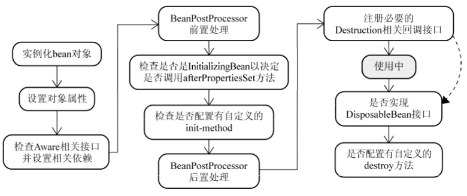

# Bean 生命周期

对于普通的Java对象，当new的时候创建对象，当它没有任何引用的时候被垃圾回收机制回收。而由Spring IoC容器托管的对象，它们的生命周期完全由容器控制。



## Bean生命周期流程

### 1.实例化Bean

实例化Bean对于BeanFactory容器，当客户向容器请求一个尚未初始化的bean时，或初始化bean的时候需要注入另一个尚未初始化的依赖时，容器就会调用createBean进行实例化。 

对于ApplicationContext容器，当容器启动结束后，便实例化所有的bean。 

容器通过获取BeanDefinition对象中的信息进行实例化。并且这一步仅仅是简单的实例化，并未进行依赖注入。 实例化对象被包装在BeanWrapper对象中，BeanWrapper提供了设置对象属性的接口，从而避免了使用反射机制设置属性。

### 2.设置对象属性（依赖注入）

实例化后的对象被封装在BeanWrapper对象中，并且此时对象仍然是一个原生的状态，并没有进行依赖注入。 紧接着，Spring根据BeanDefinition中的信息进行依赖注入。 并且通过BeanWrapper提供的设置属性的接口完成依赖注入。
   
### 3.注入Aware接口

紧接着，Spring会检测该对象是否实现了xxxAware接口，并将相关的xxxAware实例注入给bean。

- 如果这个Bean实现了BeanNameAware接口，会调用它实现的setBeanName(String beanId)方法，此处传递的是Spring配置文件中Bean的ID

- 如果这个Bean实现了BeanFactoryAware接口，会调用它实现的setBeanFactory()，传递的是Spring工厂本身（可以用这个方法获取到其他Bean）

- 如果这个Bean实现了ApplicationContextAware接口，会调用setApplicationContext(ApplicationContext)方法，传入Spring上下文，ApplicationContext是BeanFactory的子接口，有更多的实现方法

### 4.BeanPostProcessor

当经过上述几个步骤后，bean对象已经被正确构造，但如果你想要对象被使用前再进行一些自定义的处理，就可以通过BeanPostProcessor接口实现。 

该接口提供了两个函数：

- postProcessBeforeInitialzation( Object bean, String beanName )

当前正在初始化的bean对象会被传递进来，我们就可以对这个bean作任何处理。 这个函数会先于InitialzationBean执行，因此称为前置处理。 所有Aware接口的注入就是在这一步完成的。

- postProcessAfterInitialzation( Object bean, String beanName )

当前正在初始化的bean对象会被传递进来，我们就可以对这个bean作任何处理。 这个函数会在InitialzationBean完成后执行，因此称为后置处理。

### 5.InitializingBean与init-method

当BeanPostProcessor的前置处理完成后就会进入本阶段。 

InitializingBean接口只有一个函数

- afterPropertiesSet()

这一阶段也可以在bean正式构造完成前增加我们自定义的逻辑，但它与前置处理不同，由于该函数并不会把当前bean对象传进来，因此在这一步没办法处理对象本身，只能增加一些额外的逻辑。 若要使用它，我们需要让bean实现该接口，并把要增加的逻辑写在该函数中。然后Spring会在前置处理完成后检测当前bean是否实现了该接口，并执行afterPropertiesSet函数。

当然，Spring为了降低对客户代码的侵入性，给bean的配置提供了init-method属性，该属性指定了在这一阶段需要执行的函数名。Spring便会在初始化阶段执行我们设置的函数。init-method本质上仍然使用了InitializingBean接口。

### 6. DisposableBean和destroy-method

和init-method一样，通过给destroy-method指定函数，就可以在bean销毁前执行指定的逻辑。

## 代码示例

### 注解方式

```java
package com.easy.bean;

import lombok.extern.slf4j.Slf4j;
import org.springframework.stereotype.Component;

import javax.annotation.PostConstruct;
import javax.annotation.PreDestroy;

@Component
@Slf4j
public class AnnotationBean {
    @PostConstruct
    public void start() {
        log.info("AnnotationBean 开始初始化");
    }

    @PreDestroy
    public void destroy() {
        log.info("AnnotationBean 开始销毁");
    }
}
```

### InitializingBean, DisposableBean 接口

```java
package com.easy.bean;

import lombok.extern.slf4j.Slf4j;
import org.springframework.beans.factory.DisposableBean;
import org.springframework.beans.factory.InitializingBean;
import org.springframework.stereotype.Service;

@Service
@Slf4j
public class SpringLifeCycleService implements InitializingBean, DisposableBean {

    @Override
    public void afterPropertiesSet() throws Exception {
        log.info("SpringLifeCycleService 开始");
    }

    @Override
    public void destroy() throws Exception {
        log.info("SpringLifeCycleService 销毁");
    }
}
```

### 自定义初始化和销毁方法

```java
package com.easy.bean;

import lombok.extern.slf4j.Slf4j;

@Slf4j
public class SpringLifeCycle {
    public void start() {
        log.info("SpringLifeCycle 开始初始化");
    }

    public void destroy() {
        log.info("SpringLifeCycle 开始销毁");
    }
}
```

配置添加

```java
package com.easy.bean;

import org.springframework.context.annotation.Bean;
import org.springframework.context.annotation.Configuration;

@Configuration
public class LifeCycleConfig {
    @Bean(initMethod = "start", destroyMethod = "destroy")
    public SpringLifeCycle create() {
        SpringLifeCycle springLifeCycle = new SpringLifeCycle();
        return springLifeCycle;
    }
}
```

或者通过xml配置如下
```xml
<bean class="com.easy.bean.SpringLifeCycle" init-method="start" destroy-method="destroy"></bean>
```

### 实现 xxxAware 接口

```java
package com.easy.bean;

import lombok.extern.slf4j.Slf4j;
import org.springframework.beans.BeansException;
import org.springframework.context.ApplicationContext;
import org.springframework.context.ApplicationContextAware;
import org.springframework.stereotype.Component;

@Component
@Slf4j
public class SpringLifeCycleAware implements ApplicationContextAware {

    private ApplicationContext applicationContext;

    @Override
    public void setApplicationContext(ApplicationContext applicationContext) throws BeansException {
        this.applicationContext = applicationContext;
        log.info("SpringLifeCycleAware 开始");
    }
}
```

这样在 springLifeCycleAware 这个 bean 初始化会就会调用 setApplicationContext 方法，并可以获得 applicationContext 对象。

### BeanPostProcessor 增强处理器

实现 BeanPostProcessor 接口，Spring 中所有 bean 在做初始化时都会调用该接口中的两个方法，可以用于对一些特殊的 bean 进行处理

```java
package com.easy.bean;

import lombok.extern.slf4j.Slf4j;
import org.springframework.beans.BeansException;
import org.springframework.beans.factory.config.BeanPostProcessor;
import org.springframework.stereotype.Component;

@Component
@Slf4j
public class SpringLifeCycleProcessor implements BeanPostProcessor {

    /**
     * 预初始化 初始化之前调用
     *
     * @param bean
     * @param beanName
     * @return
     * @throws BeansException
     */
    @Override
    public Object postProcessBeforeInitialization(Object bean, String beanName) throws BeansException {
        if ("annotationBean".equals(beanName)) {
            log.info("SpringLifeCycleProcessor 开始初始化 beanName={}", beanName);
        }
        return bean;
    }

    /**
     * 后初始化  bean 初始化完成调用
     *
     * @param bean
     * @param beanName
     * @return
     * @throws BeansException
     */
    @Override
    public Object postProcessAfterInitialization(Object bean, String beanName) throws BeansException {
        if ("annotationBean".equals(beanName)) {
            log.info("SpringLifeCycleProcessor 初始化结束 beanName={}", beanName);
        }
        return bean;
    }
}
```

## 运行示例查看控制台输出

```cfml
2020-01-09 17:46:37.022  INFO 9544 --- [           main] o.a.c.c.C.[Tomcat].[localhost].[/]       : Initializing Spring embedded WebApplicationContext
2020-01-09 17:46:37.023  INFO 9544 --- [           main] o.s.web.context.ContextLoader            : Root WebApplicationContext: initialization completed in 1642 ms
2020-01-09 17:46:37.081  INFO 9544 --- [           main] com.easy.bean.SpringLifeCycleProcessor   : SpringLifeCycleProcessor 开始初始化 beanName=annotationBean
2020-01-09 17:46:37.089  INFO 9544 --- [           main] com.easy.bean.AnnotationBean             : AnnotationBean 开始初始化
2020-01-09 17:46:37.089  INFO 9544 --- [           main] com.easy.bean.SpringLifeCycleProcessor   : SpringLifeCycleProcessor 初始化结束 beanName=annotationBean
2020-01-09 17:46:37.090  INFO 9544 --- [           main] com.easy.bean.SpringLifeCycleAware       : SpringLifeCycleAware 开始
2020-01-09 17:46:37.091  INFO 9544 --- [           main] com.easy.bean.SpringLifeCycleService     : SpringLifeCycleService 开始
2020-01-09 17:46:37.093  INFO 9544 --- [           main] com.easy.bean.SpringLifeCycle            : SpringLifeCycle 开始初始化
2020-01-09 17:46:37.279  INFO 9544 --- [           main] o.s.s.concurrent.ThreadPoolTaskExecutor  : Initializing ExecutorService 'applicationTaskExecutor'
```

## 资料

- [bean生命周期示例源码](https://github.com/smltq/spring-boot-demo/blob/master/bean)
- [官方文档](https://docs.spring.io/spring/docs/3.0.0.M3/reference/html/ch04s04.html)
- [参考资料](https://www.zhihu.com/question/38597960)