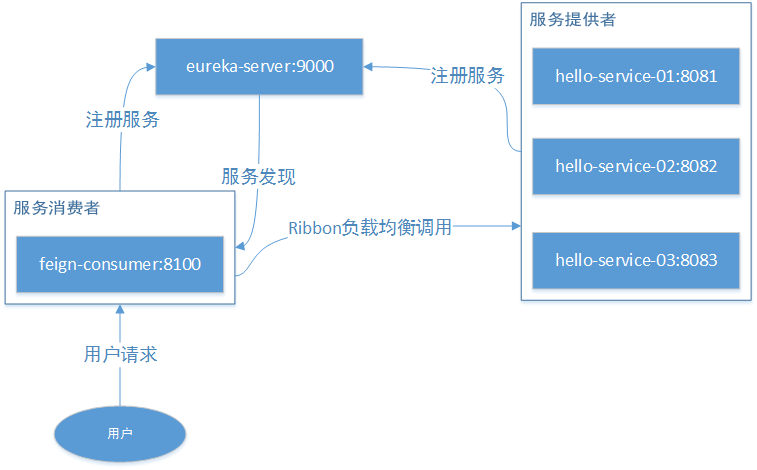
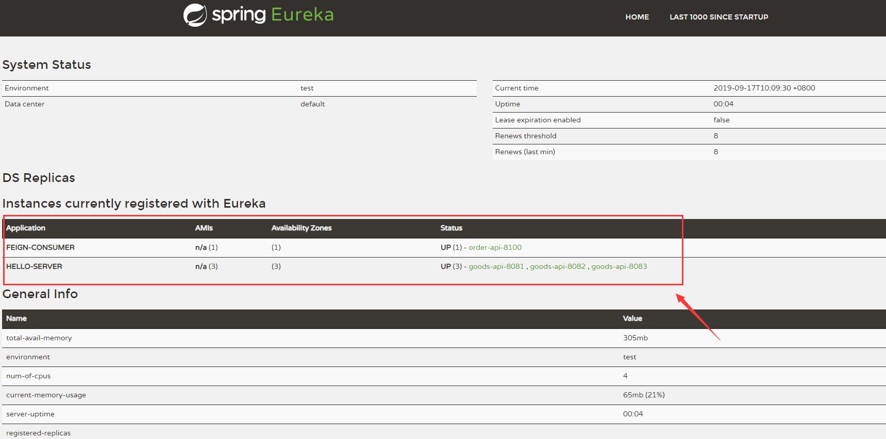

# Spring Cloud Eureka 分布式开发之服务注册中心、负载均衡、声明式服务调用实现



## 介绍

本示例主要介绍 Spring Cloud 系列中的 Eureka，使你能快速上手负载均衡、声明式服务、服务注册中心等

### Eureka Server

Eureka 是 Netflix 的子模块，它是一个基于 REST 的服务，用于定位服务，以实现云端中间层服务发现和故障转移。

服务注册和发现对于微服务架构而言，是非常重要的。有了服务发现和注册，只需要使用服务的标识符就可以访问到服务，而不需要修改服务调用的配置文件。该功能类似于 Dubbo 的注册中心，比如 Zookeeper。

Eureka 采用了 CS 的设计架构。Eureka Server 作为服务注册功能的服务端，它是服务注册中心。而系统中其他微服务则使用 Eureka 的客户端连接到 Eureka Server 并维持心跳连接

Eureka Server 提供服务的注册服务。各个服务节点启动后会在 Eureka Server 中注册服务，Eureka Server 中的服务注册表会存储所有可用的服务节点信息。

Eureka Client 是一个 Java 客户端，用于简化 Eureka Server 的交互，客户端同时也具备一个内置的、使用轮询负载算法的负载均衡器。在应用启动后，向 Eureka Server 发送心跳（默认周期 30 秒）。如果 Eureka Server 在多个心跳周期内没有接收到某个节点的心跳，Eureka Server 会从服务注册表中将该服务节点信息移除。

    简单理解：各个微服务将自己的信息注册到server上，需要调用的时候从server中获取到其他微服务信息
    
### Ribbon

Spring Cloud Ribbon 是基于 Netflix Ribbon 实现的一套客户端负载均衡工具，其主要功能是提供客户端的软件负载均衡算法，将 Netflix 的中间层服务连接在一起。

Ribbon 提供多种负载均衡策略：如轮询、随机、响应时间加权等。

### Feign

Feign是声明式、模板化的HTTP客户端，可以更加快捷优雅的调用HTTP API。在部分场景下和Ribbon类似，都是进行数据的请求处理，但是在请求参数使用实体类的时候显然更加方便，同时还支持安全性、授权控制等。
Feign是集成了Ribbon的，也就是说如果引入了Feign，那么Ribbon的功能也能使用，比如修改负载均衡策略等

## 代码实现

### 1.创建eureka-server服务注册中心

#### pom.xml pom配置

```xml
<?xml version="1.0" encoding="UTF-8"?>
<project xmlns="http://maven.apache.org/POM/4.0.0" xmlns:xsi="http://www.w3.org/2001/XMLSchema-instance"
         xsi:schemaLocation="http://maven.apache.org/POM/4.0.0 http://maven.apache.org/xsd/maven-4.0.0.xsd">
    <modelVersion>4.0.0</modelVersion>

    <groupId>com.easy</groupId>
    <artifactId>eureka-server</artifactId>
    <version>0.0.1-SNAPSHOT</version>
    <packaging>jar</packaging>

    <name>eureka-server</name>
    <description>Demo project for Spring Boot</description>

    <parent>
        <artifactId>cloud-feign</artifactId>
        <groupId>com.easy</groupId>
        <version>1.0.0</version>
    </parent>

    <dependencies>
        <dependency>
            <groupId>org.springframework.cloud</groupId>
            <artifactId>spring-cloud-starter-netflix-eureka-server</artifactId>
        </dependency>
        <dependency>
            <groupId>org.springframework.boot</groupId>
            <artifactId>spring-boot-starter-test</artifactId>
            <scope>test</scope>
        </dependency>
    </dependencies>

    <build>
        <plugins>
            <plugin>
                <groupId>org.springframework.boot</groupId>
                <artifactId>spring-boot-maven-plugin</artifactId>
            </plugin>
        </plugins>
    </build>
</project>

```

#### application.yml 配置文件

```yaml
server:
    port: 9000

spring:
  application:
    name: eureka-server
    
eureka:
    instance:
        hostname: localhost   # eureka 实例名称
    client:
        register-with-eureka: false # 不向注册中心注册自己
        fetch-registry: false       # 是否检索服务
        service-url:
            defaultZone: http://${eureka.instance.hostname}:${server.port}/eureka/  # 注册中心访问地址
```

#### EurekaServerApplication.java 启动类

```java
package com.easy.eurekaServer;

import org.springframework.boot.SpringApplication;
import org.springframework.boot.autoconfigure.SpringBootApplication;
import org.springframework.cloud.netflix.eureka.server.EnableEurekaServer;

@EnableEurekaServer
@SpringBootApplication
public class EurekaServerApplication {
    public static void main(String[] args) {
        SpringApplication.run(EurekaServerApplication.class, args);
    }
}

```

### 2.创建hello-service-api接口

#### Result.java 统一返回实体

```java
package com.easy.helloServiceApi.vo;


import lombok.Getter;

import java.io.Serializable;

@Getter
public class Result implements Serializable {

    private static final long serialVersionUID = -8143412915723961070L;

    private int code;

    private String msg;

    private Object data;

    private Result() {
    }

    private Result(int code, String msg) {
        this.code = code;
        this.msg = msg;
    }

    private Result(int code, String msg, Object data) {
        this.code = code;
        this.msg = msg;
        this.data = data;
    }


    public static Result success() {
        return success(null);
    }

    public static Result success(Object data) {
        return new Result(200, "success", data);
    }

    public static Result fail() {
        return fail(500, "fail");
    }

    public static Result fail(int code, String message) {
        return new Result(code, message);
    }
}

```

#### Order.java 订单实体类

```java
package com.easy.helloServiceApi.model;

import lombok.AllArgsConstructor;
import lombok.Data;
import lombok.NoArgsConstructor;

/**
 * 订单类
 */
@Data
@NoArgsConstructor
@AllArgsConstructor
public class Order {

    private String orderId;

    private String goodsId;

    private int num;

}
```

#### GoodsServiceClient.java 声明商品服务类

```java
package com.easy.helloServiceApi.client;

import com.easy.helloServiceApi.vo.Result;
import org.springframework.cloud.openfeign.FeignClient;
import org.springframework.web.bind.annotation.PathVariable;
import org.springframework.web.bind.annotation.RequestMapping;

@FeignClient(value = "hello-server")
public interface GoodsServiceClient {

    @RequestMapping("/goods/goodsInfo/{goodsId}")
    Result goodsInfo(@PathVariable("goodsId") String goodsId);
}
```

#### Goods.java商品实体类

```java
package com.easy.helloServiceApi.model;

import lombok.AllArgsConstructor;
import lombok.Data;
import lombok.NoArgsConstructor;
import lombok.ToString;

/**
 * 商品类
 */
@Data
@NoArgsConstructor
@AllArgsConstructor
@ToString
public class Goods {

    private String goodsId;

    private String name;

    private String descr;

    // 测试端口
    private int port;
}

```

### 3.创建hello-service-01服务提供者(这里创建三个一样的服务提供者做负载均衡用)

#### GoodsController.java商品服务入口

```java

package com.easy.helloService.controller;

import com.easy.helloService.service.GoodsService;
import com.easy.helloServiceApi.model.Goods;
import com.easy.helloServiceApi.vo.Result;
import org.springframework.beans.factory.annotation.Autowired;
import org.springframework.web.bind.annotation.PathVariable;
import org.springframework.web.bind.annotation.RequestMapping;
import org.springframework.web.bind.annotation.RestController;

@RestController
@RequestMapping("/goods")
public class GoodsController {

    @Autowired
    private GoodsService goodsService;

    @RequestMapping("/goodsInfo/{goodsId}")
    public Result goodsInfo(@PathVariable String goodsId) {

        Goods goods = this.goodsService.findGoodsById(goodsId);
        return Result.success(goods);
    }
}

```

#### GoodsService.java接口

```java
package com.easy.helloService.service;

import com.easy.helloServiceApi.model.Goods;

public interface GoodsService {

    Goods findGoodsById(String goodsId);
}

```

#### GoodsServiceImpl.java实现接口

```java
package com.easy.helloService.service.impl;

import com.easy.helloService.service.GoodsService;
import com.easy.helloServiceApi.model.Goods;
import org.springframework.stereotype.Service;

import java.util.HashMap;
import java.util.Map;

@Service
public class GoodsServiceImpl implements GoodsService {

    // 模拟数据库
    private static Map<String, Goods> data;

    static {
        data = new HashMap<>();
        data.put("1", new Goods("1", "华为", "华为手机", 8081));  //表示调用8081端口的数据,实际上数据会放在数据库或缓存中
        data.put("2", new Goods("2", "苹果", "苹果", 8081));
    }

    @Override
    public Goods findGoodsById(String goodsId) {
        return data.get(goodsId);
    }
}

```

#### HelloServiceApplication.java启动类

```java
package com.easy.helloService;

import org.springframework.boot.SpringApplication;
import org.springframework.boot.autoconfigure.SpringBootApplication;
import org.springframework.cloud.client.discovery.EnableDiscoveryClient;

@EnableDiscoveryClient
@SpringBootApplication
public class HelloServiceApplication {

    public static void main(String[] args) {
        SpringApplication.run(HelloServiceApplication.class, args);
    }
}
```

#### application.yml配置文件,8081端口做01服务

```yaml
server:
    port: 8081

spring:
  application:
    name: hello-server
    
eureka:
    instance:
        instance-id: goods-api-8081
        prefer-ip-address: true # 访问路径可以显示 IP
    client:
        service-url:
            defaultZone: http://localhost:9000/eureka/  # 注册中心访问地址
```

### 4.创建hello-service-02服务提供者(贴出和01服务不一样的地方)

#### application.yml配置文件,8082做02服务端口

```yaml
server:
    port: 8082

spring:
  application:
    name: hello-server
    
eureka:
    instance:
        instance-id: goods-api-8082
        prefer-ip-address: true # 访问路径可以显示 IP
    client:
        service-url:
            defaultZone: http://localhost:9000/eureka/  # 注册中心访问地址
```

#### GoodsServiceImpl.java 这里故意设置不同的数据源,用来测试负载均衡有没生效使用

```java
package com.easy.helloService.service.impl;

import com.easy.helloService.service.GoodsService;
import com.easy.helloServiceApi.model.Goods;
import org.springframework.stereotype.Service;

import java.util.HashMap;
import java.util.Map;

@Service
public class GoodsServiceImpl implements GoodsService {

    // 模拟数据库
    private static Map<String, Goods> data;

    static {
        data = new HashMap<>();
        data.put("1", new Goods("1", "华为", "华为手机", 8082));  //表示8082端口的数据,实际上数据会放在数据库或缓存中
        data.put("2", new Goods("2", "苹果", "苹果", 8082));
    }

    @Override
    public Goods findGoodsById(String goodsId) {
        return data.get(goodsId);
    }
}

```

### 5.创建hello-service-02服务提供者(贴出和01服务不一样的地方)

#### application.yml配置文件,8082做02服务端口

```yaml
server:
    port: 8083

spring:
  application:
    name: hello-server
    
eureka:
    instance:
        instance-id: goods-api-8083
        prefer-ip-address: true # 访问路径可以显示 IP
    client:
        service-url:
            defaultZone: http://localhost:9000/eureka/  # 注册中心访问地址
```

#### GoodsServiceImpl.java 这里故意设置不同的数据源,用来测试负载均衡有没生效使用

```java
package com.easy.helloService.service.impl;

import com.easy.helloService.service.GoodsService;
import com.easy.helloServiceApi.model.Goods;
import org.springframework.stereotype.Service;

import java.util.HashMap;
import java.util.Map;

@Service
public class GoodsServiceImpl implements GoodsService {

    // 模拟数据库
    private static Map<String, Goods> data;

    static {
        data = new HashMap<>();
        data.put("1", new Goods("1", "华为", "华为手机", 8083));  //表示8083端口的数据,实际上数据会放在数据库或缓存中
        data.put("2", new Goods("2", "苹果", "苹果", 8083));
    }

    @Override
    public Goods findGoodsById(String goodsId) {
        return data.get(goodsId);
    }
}

```

### 6.创建feign-consumer服务消费者,引入Ribbon实现服务调用负载均衡并实现声明式服务调用

#### pom.xml配置

```xml
<?xml version="1.0" encoding="UTF-8"?>
<project xmlns="http://maven.apache.org/POM/4.0.0" xmlns:xsi="http://www.w3.org/2001/XMLSchema-instance"
         xsi:schemaLocation="http://maven.apache.org/POM/4.0.0 http://maven.apache.org/xsd/maven-4.0.0.xsd">
    <modelVersion>4.0.0</modelVersion>

    <groupId>com.easy</groupId>
    <artifactId>feign-consumer</artifactId>
    <version>0.0.1-SNAPSHOT</version>
    <packaging>war</packaging>

    <name>feign-consumer</name>
    <description>Demo project for Spring Boot</description>

    <parent>
        <artifactId>cloud-feign</artifactId>
        <groupId>com.easy</groupId>
        <version>1.0.0</version>
    </parent>

    <dependencies>

        <!-- springmvc -->
        <dependency>
            <groupId>org.springframework.boot</groupId>
            <artifactId>spring-boot-starter-web</artifactId>
        </dependency>

        <!-- eureka 客户端 -->
        <dependency>
            <groupId>org.springframework.cloud</groupId>
            <artifactId>spring-cloud-starter-netflix-eureka-client</artifactId>
        </dependency>

        <!-- ribbon -->
        <dependency>
            <groupId>org.springframework.cloud</groupId>
            <artifactId>spring-cloud-starter-netflix-ribbon</artifactId>
        </dependency>

        <!-- feign -->
        <dependency>
            <groupId>org.springframework.cloud</groupId>
            <artifactId>spring-cloud-starter-openfeign</artifactId>
        </dependency>

        <dependency>
            <groupId>org.apache.commons</groupId>
            <artifactId>commons-lang3</artifactId>
            <version>3.9</version>
        </dependency>

        <dependency>
            <groupId>org.springframework.boot</groupId>
            <artifactId>spring-boot-starter-test</artifactId>
            <scope>test</scope>
        </dependency>
        <dependency>
            <groupId>com.easy</groupId>
            <artifactId>hello-service-api</artifactId>
            <version>0.0.1</version>
        </dependency>
    </dependencies>

    <build>
        <plugins>
            <plugin>
                <groupId>org.springframework.boot</groupId>
                <artifactId>spring-boot-maven-plugin</artifactId>
            </plugin>
        </plugins>
    </build>
</project>

```

引入openfeign、ribbon、eureka-client等依赖，openfeign用来实现声明式服务调用，ribbon用来实现负载均衡，eureka-client用来注册、发现服务

#### RestConfiguration.java 配置

```java
package com.easy.feignConsumer.config;

import com.netflix.loadbalancer.IRule;
import com.netflix.loadbalancer.RandomRule;
import org.springframework.cloud.client.loadbalancer.LoadBalanced;
import org.springframework.context.annotation.Bean;
import org.springframework.context.annotation.Configuration;
import org.springframework.web.client.RestTemplate;

@Configuration
public class RestConfiguration {

    @Bean
    @LoadBalanced
    public RestTemplate getRestTemplate() {
        return new RestTemplate();
    }

    /**
     * 随机选取负载均衡策略
     * @return
     */
    @Bean
    public IRule testRule() {
        return new RandomRule();
    }
}
```

#### GoodsService 服务类接口

```java
package com.easy.feignConsumer.service;

import com.easy.helloServiceApi.model.Goods;
import com.easy.helloServiceApi.vo.Result;

public interface GoodsService {
    Result placeGoods(Goods goods);
}
```

#### GoodsServiceImpl.java 实现类

```java
package com.easy.feignConsumer.service.impl;

import com.easy.feignConsumer.service.GoodsService;
import com.easy.helloServiceApi.client.GoodsServiceClient;
import com.easy.helloServiceApi.model.Goods;
import com.easy.helloServiceApi.vo.Result;
import lombok.extern.slf4j.Slf4j;
import org.apache.commons.lang3.builder.ToStringBuilder;
import org.springframework.beans.factory.annotation.Autowired;
import org.springframework.stereotype.Service;

@Service
@Slf4j
public class GoodsServiceImpl implements GoodsService {

    @Autowired
    private GoodsServiceClient goodsServiceClient;

    @Override
    public Result placeGoods(Goods order) {

        Result result = this.goodsServiceClient.goodsInfo(order.getGoodsId());

        if (result != null && result.getCode() == 200) {
            log.info("=====获取本地商品====");
            log.info("接口返回数据为==>{}", ToStringBuilder.reflectionToString(result.getData()));
        }
        return result;
    }
}

```

#### GoodsController.java 控制器

```java
package com.easy.feignConsumer.controller;

import com.easy.feignConsumer.service.GoodsService;
import com.easy.helloServiceApi.model.Goods;
import com.easy.helloServiceApi.vo.Result;
import org.springframework.beans.factory.annotation.Autowired;
import org.springframework.web.bind.annotation.RequestMapping;
import org.springframework.web.bind.annotation.RestController;

@RestController
@RequestMapping("/goods")
public class GoodsController {

    @Autowired
    private GoodsService orderService;

    @RequestMapping("/place")
    public Result placeGoods(Goods goods) {
        Result result = this.orderService.placeGoods(goods);
        return result;
    }
}
```

#### FeignConsumerApplication.java 消息者启动类

```java
package com.easy.feignConsumer;

import org.springframework.boot.SpringApplication;
import org.springframework.boot.autoconfigure.SpringBootApplication;
import org.springframework.cloud.netflix.eureka.EnableEurekaClient;
import org.springframework.cloud.openfeign.EnableFeignClients;

@EnableFeignClients(basePackages = {"com.easy"})
@EnableEurekaClient
@SpringBootApplication
public class FeignConsumerApplication {

    public static void main(String[] args) {
        SpringApplication.run(FeignConsumerApplication.class, args);
    }
}
```

#### application.yml 配置文件

```yaml
server:
  port: 8100

spring:
  application:
    name: feign-consumer

eureka:
  instance:
    instance-id: order-api-8100
    prefer-ip-address: true # 访问路径可以显示 IP
  client:
    service-url:
      defaultZone: http://localhost:9000/eureka/  # 注册中心访问地址
```

## 使用示例

### 运行创建的5个服务

1个服务注册中心，3个服务提供者，1个服务消费者

### 进入服务注册中心查看服务

地址栏输入：http://localhost:9000/，我们看到5个服务注册成功并且都是运行状态了（UP状态），效果如下：



- Application列下有两个服务（FEIGN-CONSUMER、HELLO-SERVER）
- Availability Zones列下表示可用服务分别的数量（这里分别显示1和3)
- Status 列显示服务状态，UP表示服务在运行状态，后面分别跟着服务的内部地址：goods-api-8100（服务消费者）,goods-api-8081（服务提供者01）, goods-api-8082（服务提供者02）, goods-api-8083（服务提供者03）

### 调用接口测试

地址栏输入：http://localhost:8100/goods/place?goodsId=1，返回数据结果为：

```json
{
code: 200,
msg: "success",
data: {
goodsId: "1",
name: "华为",
descr: "华为手机",
port: 8081
}
}
```

- 多刷新几次页面，我们发现port会在8081 8082 8083随机变化，表示我们的随机负载均衡器生效了
- 随意关掉2个或1个服务提供者，刷新页面接口功能无影响，能正常返回数据，实现了高可用

## 声明式服务和非声明式服务对比

### 非声明式服务调用代码

```java
    @Test
    public void testFeignConsumer() {
        Goods goods = new Goods();
        goods.setGoodsId("1");
        Result result = this.restTemplate.getForObject("http://HELLO-SERVER/goods/goodsInfo/" + goods.getGoodsId(), Result.class);
        log.info("成功调用了服务，返回结果==>{}", ToStringBuilder.reflectionToString(result));
    }
```

消费端每个请求方法中都需要拼接请求服务的 URL 地址，存在硬编码问题并且这样并不符合面向对象编程的思想

### 声明式服务调用

```java
@FeignClient(value = "hello-server")
public interface GoodsServiceClient {

    @RequestMapping("/goods/goodsInfo/{goodsId}")
    Result goodsInfo(@PathVariable("goodsId") String goodsId);
}
```

```java
    @Autowired
    private GoodsServiceClient goodsServiceClient;

    @Override
    public Result placeGoods(Goods order) {
        Result result = this.goodsServiceClient.goodsInfo(order.getGoodsId());
        return result;
    }
```

通过编写简单的接口和插入注解，就可以定义好HTTP请求的参数、格式、地址等信息，实现远程接口调用，这样将使我们的代码更易扩展和利用，复合面向对象编程实现。

## 资料

- [Spring Cloud Feign 示例源码](https://github.com/smltq/spring-boot-demo/blob/master/cloud-feign)
- [参考资料](https://www.extlight.com/2018/07/10/Spring-Cloud-%E5%85%A5%E9%97%A8-%E4%B9%8B-Feign-%E7%AF%87%EF%BC%88%E4%B8%89%EF%BC%89/)
- [官方资料](https://cloud.spring.io/spring-cloud-netflix/multi/multi_spring-cloud-feign.html)