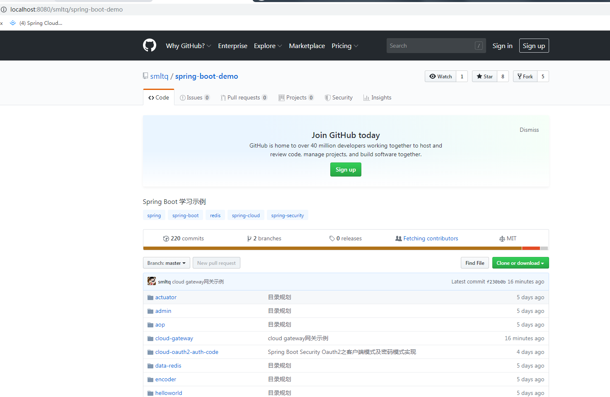

# Spring Cloud Gateway 服务网关

API 主流网关有NGINX、ZUUL、Spring Cloud Gateway、Linkerd等；Spring Cloud Gateway构建于 Spring 5+，基于 Spring Boot 2.x 响应式的、非阻塞式的 API。同时，它支持 websockets，和 Spring 框架紧密集成，用来代替服务网关Zuul，开发体验相对来说十分不错。

Spring Cloud Gateway 是 Spring Cloud 微服务平台的一个子项目，属于 Spring 开源社区，依赖名叫：spring-cloud-starter-gateway。
Zuul 是 Netflix 公司的开源项目，Spring Cloud 在 Netflix 项目中也已经集成了 Zuul，依赖名叫：spring-cloud-starter-netflix-zuul。

## API 网关

API 网关出现的原因是微服务架构的出现，不同的微服务一般会有不同的网络地址，而外部客户端可能需要调用多个服务的接口才能完成一个业务需求，如果让客户端直接与各个微服务通信，会有以下的问题：

- 客户端会多次请求不同的微服务，增加了客户端的复杂性。
- 存在跨域请求，在一定场景下处理相对复杂。
- 认证复杂，每个服务都需要独立认证。
- 难以重构，随着项目的迭代，可能需要重新划分微服务。例如，可能将多个服务合并成一个或者将一个服务拆分成多个。如果客户端直接与微服务通信，那么重构将会很难实施。
- 某些微服务可能使用了防火墙 / 浏览器不友好的协议，直接访问会有一定的困难。

以上这些问题可以借助 API 网关解决。API 网关是介于客户端和服务器端之间的中间层，所有的外部请求都会先经过 API 网关这一层。也就是说，API 的实现方面更多的考虑业务逻辑，而安全、性能、监控可以交由 API 网关来做，这样既提高业务灵活性又不缺安全性。

## 使用 API 网关后的优点如下：

- 易于监控。可以在网关收集监控数据并将其推送到外部系统进行分析。
- 易于认证。可以在网关上进行认证，然后再将请求转发到后端的微服务，而无须在每个微服务中进行认证。
- 减少了客户端与各个微服务之间的交互次数。

## Spring Cloud Gateway的特征

- Java 8
- Spring Framework 5
- Spring Boot 2
- 动态路由
- 内置到Spring Handler映射中的路由匹配
- 基于HTTP请求的路由匹配 (Path, Method, Header, Host, etc…​)
- 过滤器作用于匹配的路由
- 过滤器可以修改下游HTTP请求和HTTP响应 (Add/Remove Headers, Add/Remove Parameters, Rewrite Path, Set Path, Hystrix, etc…​)
- 通过API或配置驱动
- 支持Spring Cloud DiscoveryClient配置路由，与服务发现与注册配合使用

## 快速上手

[Spring Cloud Gateway 示例源码](https://github.com/smltq/spring-boot-demo/blob/master/cloud-gateway)

Spring Cloud Gateway 网关路由有两种配置方式：

- 在配置文件 yml 中配置
- 通过@Bean自定义 RouteLocator，在启动主类 Application 中配置

这两种方式是等价的，建议使用 yml 方式进配置。

### 1.pom.xml Maven依赖

```xml
    <parent>
        <groupId>org.springframework.boot</groupId>
        <artifactId>spring-boot-starter-parent</artifactId>
        <version>2.1.7.RELEASE</version>
        <relativePath/> <!-- lookup parent from repository -->
    </parent>

    <dependencyManagement>
        <dependencies>
            <dependency>
                <groupId>org.springframework.cloud</groupId>
                <artifactId>spring-cloud-dependencies</artifactId>
                <version>Greenwich.RELEASE</version>
                <type>pom</type>
                <scope>import</scope>
            </dependency>
        </dependencies>
    </dependencyManagement>

    <dependencies>
        <!--Spring Cloud Gateway 是使用 netty+webflux 实现因此不需要再引入 web 模块-->
        <dependency>
            <groupId>org.springframework.cloud</groupId>
            <artifactId>spring-cloud-starter-gateway</artifactId>
        </dependency>
    </dependencies>

    <build>
        <plugins>
            <plugin>
                <groupId>org.springframework.boot</groupId>
                <artifactId>spring-boot-maven-plugin</artifactId>
            </plugin>
        </plugins>
    </build>
```

### 2.application.yml配置

```yaml
server:
  port: 8080
spring:
  cloud:
    gateway:
      routes:
        - id: easy_route # 我们自定义的路由 ID，保持唯一
          uri: https://github.com # 目标服务地址
          predicates: # 路由条件，Predicate 接受一个输入参数，返回一个布尔值结果。该接口包含多种默认方法来将
            - Path=/smltq/spring-boot-demo
```
上面这段配置的意思是，配置了一个 id 为 easy_route 的路由规则，当访问地址 http://localhost:8080/smltq/spring-boot-demo时会自动转发到地址：https://github.com/smltq/spring-boot-demo。

### 3.配置完成启动项目

在浏览器访问进行测试，当我们访问 http://localhost:8080/smltq/spring-boot-demo 时会展示如下页面：



## 资料

- [Spring Cloud Gateway 示例源码](https://github.com/smltq/spring-boot-demo/blob/master/cloud-gateway)
- [更多路由分发功能参考官网](https://cloud.spring.io/spring-cloud-static/Greenwich.SR1/single/spring-cloud.html#_spring_cloud_gateway)
- [Spring Boot、Spring Cloud示例学习](https://github.com/smltq/spring-boot-demo)
