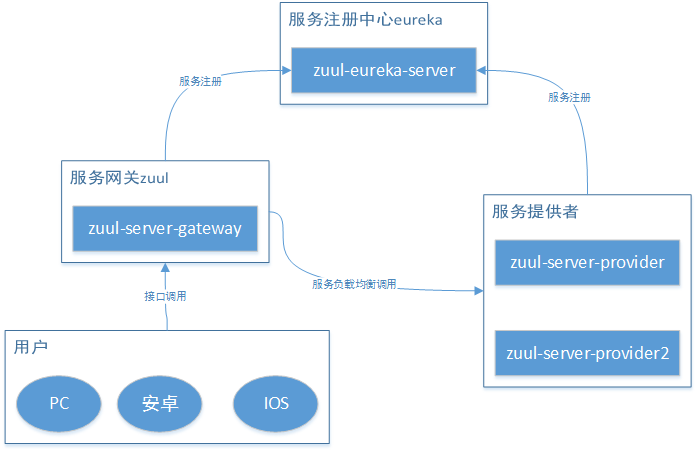

# Spring Cloud Zuul



## 开发环境

- idea 2019.1.2
- jdk1.8.0_201
- Spring Boot 2.1.9.RELEASE
- Spring Cloud Greenwich SR3

## Zuul介绍

Zuul是Netflix开发的一款提供动态路由、监控、弹性、安全的网关服务，他可以和Eureka,Ribbon,Hystrix等组件配合使用。还可以通过创建过滤器对校验过滤提供支持，使微服务应用更专注于业务逻辑的开发。

使用Zuul网关服务带来的好处是统一向外系统提供REST API，并额外提供了权限控制、负载均衡等功能，并且这些功能是从原先的服务中抽离出来并单独存在的。

Zuul提供了不同类型的filter用于处理请求，这些filter可以让我们实现以下功能

- 权限控制和安全性：可以识别认证需要的信息和拒绝不满足条件的请求
- 监控：监控请求信息
- 动态路由：根据需要动态地路由请求到后台的不同服务集群
- 压力测试：逐渐增大到集群的流量，以便进行性能评估
- 负载均衡：为每种类型的请求分配容量并丢弃超过限额的请求
- 限流
- 黑白名单过滤
- 静态资源处理：直接在zuul处理静态资源的响应而不需要转发这些请求到内部集群中

### 过滤器

ZuulFilter是一个基础的抽象类，定义了一些抽象方法

- filterType方法: filter的类型，有”pre”, “route”, “post”, “error”, “static”
    - pre：在请求被路由之前执行
    - route：在请求被路由时执行
    - post：在请求被路由之后执行
    - error：在请求发生错误时执行
    - static：特殊的 Filter 具体的可以看 StaticResponseFilter，它允许从 Zuul 本身生成响应，而不是将请求转发到源
    
- filterOrder方法：优先级，级别越高，越快被执行（数值越小表示级别越高）

- shouldFilter方法：开关，如果是true，run方法会执行，否则不会执行

- run方法：filter执行的逻辑操作

## 代码实现

### 1.创建服务注册中心

创建 zuul-eureka-server 项目，引入eureka-server依赖，项目完整源码可以查看：[Spring Cloud Zuul 示例源码](https://github.com/smltq/spring-boot-demo/blob/master/cloud-zuul)

以下贴几段关键代码

pom添加依赖
```xml
        <dependency>
            <groupId>org.springframework.cloud</groupId>
            <artifactId>spring-cloud-starter-netflix-eureka-server</artifactId>
        </dependency>
```

启动类增加 @EnableEurekaServer 注解
```java
@EnableEurekaServer
@SpringBootApplication
public class ZuulEurekaServerApplication {
    public static void main(String[] args) {
        SpringApplication.run(ZuulEurekaServerApplication.class, args);
    }
}
```

yml配置
```yaml
server:
  port: 8761

spring:
  application:
    name: zuul-eureka-server

eureka:
  instance:
    hostname: localhost   # eureka 实例名称
  client:
    register-with-eureka: false # 不向注册中心注册自己
    fetch-registry: false       # 是否检索服务
    service-url:
      defaultZone: http://${eureka.instance.hostname}:${server.port}/eureka/  # 注册中心访问地址
```

### 2.创建服务提供者1

创建 zuul-server-provider 项目，引入eureka-client依赖，项目完整源码可以查看：[Spring Cloud Zuul 示例源码](https://github.com/smltq/spring-boot-demo/blob/master/cloud-zuul)

以下贴几段关键代码

pom添加依赖
```xml
        <dependency>
            <groupId>org.springframework.cloud</groupId>
            <artifactId>spring-cloud-starter-netflix-eureka-client</artifactId>
        </dependency>
```

编写HelloController服务
```java
@RestController
@Slf4j
public class HelloController {

    @RequestMapping("/hello")
    public String index(@RequestParam String name) {
        log.info("request one  name is " + name);
        return "hello " + name + "，this is first messge";
    }
}
```

启动类增加 @EnableDiscoveryClient 注解
```java
@SpringBootApplication
@EnableDiscoveryClient
public class ZuulServerProviderApplication {

    public static void main(String[] args) {
        SpringApplication.run(ZuulServerProviderApplication.class, args);
    }
}
```

yml配置
```yaml
spring:
  application:
    name: zuul-server-provider
server:
  port: 9000
eureka:
  client:
    service-url:
      defaultZone: http://localhost:8761/eureka
```

### 3.创建服务提供者2

创建 zuul-server-provider2 项目，引入eureka-client依赖，其它同服务提供者1项目，项目完整源码可以查看：[Spring Cloud Zuul 示例源码](https://github.com/smltq/spring-boot-demo/blob/master/cloud-zuul)

以下贴出差异部分代码

编写服务，这里为了做服务降级测试，为当前线程设置了一个超长休眠时间
```java
@RestController
@Slf4j
public class HelloController {
    @RequestMapping("/hello")
    public String index(@RequestParam String name) {
        log.info("request two name is " + name);
        try{
            //为做服务降级测试,设置一个超长休眠时间,故意导致该服务访问超时
            Thread.sleep(1000000);  
        }catch ( Exception e){
            log.error(" hello two error",e);
        }
        return "hello " + name + "，this is two messge";
    }
}
```

### 4.创建zuul服务网关

创建 zuul-server-gateway 项目，引入netflix-zuul及eureka-client依赖，项目完整源码可以查看：[Spring Cloud Zuul 示例源码](https://github.com/smltq/spring-boot-demo/blob/master/cloud-zuul)

以下贴几段关键代码

pom.xml配置
```xml
        <dependency>
            <groupId>org.springframework.cloud</groupId>
            <artifactId>spring-cloud-starter-netflix-eureka-client</artifactId>
        </dependency>

        <dependency>
            <groupId>org.springframework.cloud</groupId>
            <artifactId>spring-cloud-starter-netflix-zuul</artifactId>
        </dependency>
```

创建过滤器TokenFilter.java
```java
package com.easy.zuulServerGateway.filter;

import com.netflix.zuul.ZuulFilter;
import com.netflix.zuul.context.RequestContext;
import lombok.extern.slf4j.Slf4j;
import org.apache.commons.lang.StringUtils;

import javax.servlet.http.HttpServletRequest;

@Slf4j
public class TokenFilter extends ZuulFilter {

    @Override
    public String filterType() {
        //可以在请求被路由之前调用
        return "pre";
    }

    @Override
    public int filterOrder() {
        //filter执行顺序，通过数字指定 ,优先级为0，数字越大，优先级越低
        return 0;
    }

    @Override
    public boolean shouldFilter() {
        //是否执行该过滤器，此处为true，说明需要过滤
        return true;
    }

    @Override
    public Object run() {
        RequestContext ctx = RequestContext.getCurrentContext();
        HttpServletRequest request = ctx.getRequest();

        log.info("--->>> TokenFilter {},{}", request.getMethod(), request.getRequestURL().toString());

        //获取请求的参数
        String token = request.getParameter("token");

        if (StringUtils.isNotBlank(token)) {
            //对请求进行路由
            ctx.setSendZuulResponse(true);
            ctx.setResponseStatusCode(200);
            ctx.set("isSuccess", true);
            return null;
        } else {
            //不对其进行路由
            ctx.setSendZuulResponse(false);
            ctx.setResponseStatusCode(400);
            ctx.setResponseBody("token is empty");
            ctx.set("isSuccess", false);
            return null;
        }
    }
}
```

创建 zuul-server-provider 服务对应的熔断器（这里针对整个服务熔断，也可以对单个服务接口做熔断处理），ProviderFallback.java
```java
package com.easy.zuulServerGateway.fallback;

import lombok.extern.slf4j.Slf4j;
import org.springframework.cloud.netflix.zuul.filters.route.FallbackProvider;
import org.springframework.http.HttpHeaders;
import org.springframework.http.HttpStatus;
import org.springframework.http.MediaType;
import org.springframework.http.client.ClientHttpResponse;
import org.springframework.stereotype.Component;

import java.io.ByteArrayInputStream;
import java.io.InputStream;

@Slf4j
@Component
public class ProviderFallback implements FallbackProvider {

    @Override
    public String getRoute() {
        return "zuul-server-provider";
    }

    @Override
    public ClientHttpResponse fallbackResponse(String route, Throwable cause) {
        if (cause != null) {
            String reason =cause.getMessage();
            log.info("Excption {}", reason);
        }
        return fallbackResponse();
    }

    public ClientHttpResponse fallbackResponse() {
        return new ClientHttpResponse() {
            @Override
            public HttpStatus getStatusCode() {
                return HttpStatus.OK;
            }

            @Override
            public int getRawStatusCode() {
                return 200;
            }

            @Override
            public String getStatusText(){
                return "OK";
            }

            @Override
            public void close() {

            }

            @Override
            public InputStream getBody() {
                return new ByteArrayInputStream("The service is unavailable.".getBytes());
            }

            @Override
            public HttpHeaders getHeaders() {
                HttpHeaders headers = new HttpHeaders();
                headers.setContentType(MediaType.APPLICATION_JSON);
                return headers;
            }
        };
    }
}
```

yml配置
```yaml
spring:
  application:
    name: zuul-service-gateway
server:
  port: 8888

eureka:
  client:
    service-url:
      defaultZone: http://localhost:8761/eureka

  #是否开启重试功能
zuul:
  retryable: true
  #对当前服务的重试次数
ribbon:
  MaxAutoRetries: 2
  #切换相同Server的次数
  MaxAutoRetriesNextServer: 0
```

启动类增加 @EnableZuulProxy 注解，来启动服务网关
ZuulServerGatewayApplication.java
```java
package com.easy.zuulServerGateway;

import com.easy.zuulServerGateway.filter.TokenFilter;
import org.springframework.boot.SpringApplication;
import org.springframework.boot.autoconfigure.SpringBootApplication;
import org.springframework.cloud.netflix.zuul.EnableZuulProxy;
import org.springframework.context.annotation.Bean;

@SpringBootApplication
@EnableZuulProxy
public class ZuulServerGatewayApplication {

    public static void main(String[] args) {
        SpringApplication.run(ZuulServerGatewayApplication.class, args);
    }

    @Bean
    public TokenFilter tokenFilter() {
        return new TokenFilter();
    }
}
```

至上，示例的四个服务创建完毕，接下来运行示例查看效果

## 使用

### 现有四个项目如下

zuul-eureka-server：服务注册中心，服务名：zuul-eureka-server，端口：8761
zuul-server-provider：服务提供者1，服务名：zuul-server-provider，端口：9000
zuul-server-provider2：服务提供者，服务名：zuul-server-provider，端口：9001
zuul-server-gateway：服务网关，服务名：zuul-server-gateway，端口：8888

### 运行测试

分别启动zuul-eureka-server、zuul-server-gateway、zuul-server-provider三个服务

- 访问地址：http://localhost:8888/zuul-server-provider/hello?name=yuntian，返回：token is empty ，请求被拦截返回。
- 访问地址：http://localhost:8888/zuul-server-provider/hello?name=yuntian&token=xx，返回：hello yuntian，this is first messge，说明请求正常响应。


启动zuul-server-provider2

- 多次访问http://localhost:8888/zuul-server-provider/hello?name=yuntian&token=xx，此时会交替返回

```cfml
hello yuntian，this is first messge
The service is unavailable
...

```
从返回结果可以看出：zuul-server-provider2项目已经启用了熔断，返回:The service is unavailable.

## 资料

- [Spring Cloud Zuul 示例源码](https://github.com/smltq/spring-boot-demo/blob/master/cloud-zuul)
- [Spring Boot、Spring Cloud示例学习](https://github.com/smltq/spring-boot-demo)