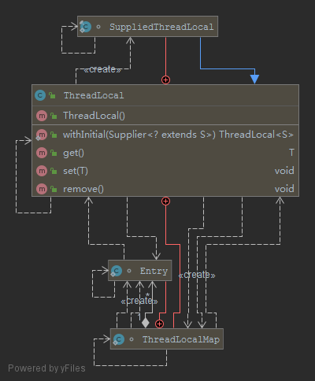

# Java并发编程之ThreadLocal解析



本文讨论的是JDK 1.8中的ThreadLocal

## ThreadLocal概念

ThreadLocal多线程间并发访问变量的解决方案，为每个线程提供变量的副本，用空间换时间。

- ThreadLocal在每个线程中对该变量会创建一个副本，即每个线程内部都会有一个该变量，且在线程内部任何地方都可以使用，线程之间互不影响，实现线程隔离，这样一来就不存在线程安全问题，也不会严重影响程序执行性能
- 由于在每个线程中都创建了副本，所以要考虑它对资源的消耗，比如内存的占用会比不使用ThreadLocal要大
- 如果使用ThreadLocal，通常定义为private static类型，在我看来最好是定义为private static final类型

## ThreadLocal使用场景

个人认为只要满足以下两点需求，就可以考虑使用ThreadLocal

- 每个线程需要有自己单独的实例
- 实例需要在多个方法中共享，但不希望被多线程共享

比如：创建数据库连接，在多线程情况下，我们肯定不希望出现A线程拿到连接未执行完，B线程就把它关闭或多个线程共用一个连接导致数据操作混乱等情况。而我们正确的姿势应该会撸上以下这样的类似代码：

```java
private static ThreadLocal<Connection> connTl = new ThreadLocal<>();

public static Connection getConnection() throws SQLException{
    Connection conn = connTl.get();
    if(conn==null){
        conn = dataSource.getConnection();
        connTl.set(conn);
    }
    return conn;
}
```

## ThreadLocal常用方法介绍

```java
class ThreadLocal<T> {
    T get();
    void set(T value);
    void remove();
}
```

### 设置当前线程的线程局部变量的值

```java
public void set(T value);
```

### 返回当前线程所对应的线程局部变量

```java
public T get();
```

### 删除该线程当前线程局部变量的值

```java
public void remove()
```

## ThreadLocal源码解析

### 在看常用方法源码前，我们要先了解下ThreadLocalMap

ThreadLocalMap是ThreadLocal内部的一个静态类

```java
 static class ThreadLocalMap {

        static class Entry extends WeakReference<ThreadLocal<?>> {
            Object value;

            Entry(ThreadLocal<?> k, Object v) {
                super(k);
                value = v;
            }
        }

        /**
         * 初始容量
         */
        private static final int INITIAL_CAPACITY = 16;

        /** 
        * 实体表 
        */
        private Entry[] table;

        /**
         * 表初始大小
         */
        private int size = 0;

        /**
         * 扩容上限，当size到达threashold时，需要resize整个Map，threshold的初始值为len * 2 / 3
         */
        private int threshold; // Default to 0

        /**
         * 将调整大小阈值设置为最坏情况下保持2/3的负载因子。
         */
        private void setThreshold(int len) {
            threshold = len * 2 / 3;
        }

        /**
         * 获取下一个索引，超出长度则返回0
         */
        private static int nextIndex(int i, int len) {
            return ((i + 1 < len) ? i + 1 : 0);
        }

        /**
         * 返回上一个索引，如果-1为负数，返回长度-1的索引
         */
        private static int prevIndex(int i, int len) {
            return ((i - 1 >= 0) ? i - 1 : len - 1);
        }

        /**
         * 构造参数创建一个ThreadLocalMap代码
         * ThreadLocal为key，我们的泛型为value
         */
        ThreadLocalMap(ThreadLocal<?> firstKey, Object firstValue) {
            table = new Entry[INITIAL_CAPACITY];
            int i = firstKey.threadLocalHashCode & (INITIAL_CAPACITY - 1);
            table[i] = new Entry(firstKey, firstValue);
            size = 1;
            setThreshold(INITIAL_CAPACITY);
        }

        /**
         * ThreadLocal本身是线程隔离的，按道理是不会出现数据共享和传递的行为的
         * 这是InheritableThreadLocal提供了了一种父子间数据共享的机制
         */
        private ThreadLocalMap(ThreadLocalMap parentMap) {
            Entry[] parentTable = parentMap.table;
            int len = parentTable.length;
            setThreshold(len);
            table = new Entry[len];

            for (int j = 0; j < len; j++) {
                Entry e = parentTable[j];
                if (e != null) {
                    @SuppressWarnings("unchecked")
                    ThreadLocal<Object> key = (ThreadLocal<Object>) e.get();
                    if (key != null) {
                        Object value = key.childValue(e.value);
                        Entry c = new Entry(key, value);
                        int h = key.threadLocalHashCode & (len - 1);
                        while (table[h] != null)
                            h = nextIndex(h, len);
                        table[h] = c;
                        size++;
                    }
                }
            }
        }

        /**
         * 获取ThreadLocal的索引位置，通过下标索引获取内容
         */
        private Entry getEntry(ThreadLocal<?> key) {
            // 通过hashcode确定下标
            int i = key.threadLocalHashCode & (table.length - 1);
            Entry e = table[i];
            // 如果找到则直接返回
            if (e != null && e.get() == key)
                return e;
            else
                // 找不到的话接着从i位置开始向后遍历，基于线性探测法，是有可能在i之后的位置找到的
                return getEntryAfterMiss(key, i, e);
        }
        
        private Entry getEntryAfterMiss(ThreadLocal<?> key, int i, Entry e) {
            Entry[] tab = table;
            int len = tab.length;

            // 循环向后遍历
            while (e != null) {
                // 获取节点对应的k
                ThreadLocal<?> k = e.get();
                // 相等则返回
                if (k == key)
                    return e;
                // 如果为null，触发一次连续段清理
                if (k == null)
                    expungeStaleEntry(i);
                // 获取下一个下标接着进行判断
                else
                    i = nextIndex(i, len);
                e = tab[i];
            }
            return null;
        }

        /**
         * ThreadLocalMap的set方法，通过这个方法，我们可以看出该哈希表是用线性探测法来解决冲突的
         */
        private void set(ThreadLocal<?> key, Object value) {
            // 新开一个引用指向table
            Entry[] tab = table;
            // 获取table的长度
            int len = tab.length;
             // 获取对应ThreadLocal在table当中的下标
            int i = key.threadLocalHashCode & (len-1);

            // 从该下标开始循环遍历
            for (Entry e = tab[i];
                 e != null;
                 e = tab[i = nextIndex(i, len)]) {
                ThreadLocal<?> k = e.get();

                // 如遇相同key，则直接替换value
                if (k == key) {
                    e.value = value;
                    return;
                }

                // 如果该key已经被回收失效，则替换该失效的key
                if (k == null) {
                    replaceStaleEntry(key, value, i);
                    return;
                }
            }
            
            // 找到空的位置，创建Entry对象并插入
            tab[i] = new Entry(key, value);
            // table内元素size自增
            int sz = ++size;
            if (!cleanSomeSlots(i, sz) && sz >= threshold)
                rehash();
        }

        /**
         * 移除key方法
         */
        private void remove(ThreadLocal<?> key) {
            Entry[] tab = table;
            int len = tab.length;
            int i = key.threadLocalHashCode & (len-1);
            for (Entry e = tab[i];
                 e != null;
                 e = tab[i = nextIndex(i, len)]) {
                if (e.get() == key) {
                    e.clear();
                    expungeStaleEntry(i);
                    return;
                }
            }
        }
    
        private void replaceStaleEntry(ThreadLocal<?> key, Object value,
                                       int staleSlot) {
            // 建个引用变量指向table
            Entry[] tab = table;
            // 获取table长度
            int len = tab.length;
            Entry e;

            // 记录当前失效的节点下标
            int slotToExpunge = staleSlot;
            
            /**
             * 由staleSlot下标开始向前扫描,查找并记录最前位置value为null的下标
             */
            for (int i = prevIndex(staleSlot, len);
                 (e = tab[i]) != null;
                 i = prevIndex(i, len))
                if (e.get() == null)
                    slotToExpunge = i;

            /**
             * 由staleSlot下标开始向后扫描
             */
            for (int i = nextIndex(staleSlot, len);
                 (e = tab[i]) != null;
                 i = nextIndex(i, len)) {
                
                // 获取Entry节点对应的ThreadLocal对象
                ThreadLocal<?> k = e.get();

                /**
                 * 如果与新的key对应，直接赋值value，替换i与staleSlot两个下标
                 */
                if (k == key) {
                    e.value = value;

                    tab[i] = tab[staleSlot];
                    tab[staleSlot] = e;

                    if (slotToExpunge == staleSlot)
                        slotToExpunge = i;                    

                    cleanSomeSlots(expungeStaleEntry(slotToExpunge), len);
                    return;
                }

                /* 如果当前下标所在已经失效，并且向后扫描过程当中没有找到失效的Entry节点，则slotToExpunge赋值为当前位置*/
                if (k == null && slotToExpunge == staleSlot)
                    slotToExpunge = i;
            }

            // 如果并没有在table当中找到该key，则直接在当前位置new一个Entry
            tab[staleSlot].value = null;
            tab[staleSlot] = new Entry(key, value);

            if (slotToExpunge != staleSlot)
                cleanSomeSlots(expungeStaleEntry(slotToExpunge), len);
        }
        
        /**        
         * 核心清理函数，它主要做的事情就是
         * 1、从staleSlot开始，向后遍历将ThreadLocal对象被回收所在Entry节点的value和Entry节点本身设置null，方便GC，并且size自减1
         * 2、会对非null的Entry节点进行rehash，只要不是在当前位置，就会将Entry挪到下一个为null的位置上
         * 所以实际上是对从staleSlot开始做一个连续段的清理和rehash操作
         */
        private int expungeStaleEntry(int staleSlot) {
            Entry[] tab = table;
            //获取长度
            int len = tab.length;

            // 将传过来的下标置null
            tab[staleSlot].value = null;
            tab[staleSlot] = null;
            size--;
            
            Entry e;
            int i;
            //遍历删除指定节点所有后续节点当中，ThreadLocal被回收的节点
            for (i = nextIndex(staleSlot, len);
                 (e = tab[i]) != null;
                 i = nextIndex(i, len)) {
                //获取entry当中的key
                ThreadLocal<?> k = e.get();
                // 如果ThreadLocal为null，则将value以及数组下标所在位置设置null，方便GC并且size-1
                if (k == null) {
                    e.value = null;
                    tab[i] = null;
                    size--;
                } else {    //如果不为null
                    //重新计算key的下标
                    int h = k.threadLocalHashCode & (len - 1);
                    
                    // 如果是当前位置则遍历下一个
                    // 不是当前位置，则重新从i开始找到下一个为null的坐标进行赋值
                    if (h != i) {
                        tab[i] = null;
                        
                        while (tab[h] != null)
                            h = nextIndex(h, len);
                        tab[h] = e;
                    }
                }
            }
            return i;
        }

        /**
        * 清理被回收的Entry
        */
        private boolean cleanSomeSlots(int i, int n) {
            boolean removed = false;
            Entry[] tab = table;
            int len = tab.length;
            do {
                i = nextIndex(i, len);
                Entry e = tab[i];
                // Entry对象不为空，但是ThreadLocal这个key已经为null,则清除
                if (e != null && e.get() == null) {
                    n = len;
                    removed = true;
                    // 调用清理函数
                    i = expungeStaleEntry(i);
                }
            } while ( (n >>>= 1) != 0);
            return removed;
        }

        /**
         * rehash操作
         */
        private void rehash() {
            expungeStaleEntries();

            // Use lower threshold for doubling to avoid hysteresis
            if (size >= threshold - threshold / 4)
                resize();
        }

        /**
         * 对table进行扩容，因为要保证table的长度是2的幂，所以扩容就扩大2倍
         */
        private void resize() {
            Entry[] oldTab = table;
            //旧表长度
            int oldLen = oldTab.length;
            //新表长度
            int newLen = oldLen * 2;
            Entry[] newTab = new Entry[newLen];
            int count = 0;

            /**
             * 从下标0开始，逐个向后遍历插入到新的table当中
             * 1、如遇到key已经为null，则value设置null，方便GC回收
             * 2、通过hashcode & len - 1计算下标，如果该位置已经有Entry数组，则通过线性探测向后探测插入
             */
            for (int j = 0; j < oldLen; ++j) {
                Entry e = oldTab[j];
                if (e != null) {
                    ThreadLocal<?> k = e.get();
                    if (k == null) {
                        e.value = null; // Help the GC
                    } else {
                        int h = k.threadLocalHashCode & (newLen - 1);
                        while (newTab[h] != null)
                            h = nextIndex(h, newLen);
                        newTab[h] = e;
                        count++;
                    }
                }
            }

            //重新设置扩容的阈值
            setThreshold(newLen);
            //更新size
            size = count;
            //指向新的Entry数组
            table = newTab;
        }

        /**
         * 清除table中所有无用的entry
         */
        private void expungeStaleEntries() {
            Entry[] tab = table;
            int len = tab.length;
            for (int j = 0; j < len; j++) {
                Entry e = tab[j];
                if (e != null && e.get() == null)
                    expungeStaleEntry(j);
            }
        }
    }
```

### get方法

```java
    public T get() {
        // 获取当前的Thread对象
        Thread t = Thread.currentThread();
        // 通过getMap获取Thread内的ThreadLocalMap
        ThreadLocalMap map = getMap(t);      
        if (map != null) {
            // 如果map已经存在，以当前的ThreadLocal为键，获取Entry对象，并从从Entry中取出值
            ThreadLocalMap.Entry e = map.getEntry(this);
            if (e != null) {
                @SuppressWarnings("unchecked")
                T result = (T)e.value;
                return result;
            }
        }
        // 如果map为空,则调用setInitialValue进行初始化
        return setInitialValue();
    }
```

#### getMap方法

```java
    ThreadLocalMap getMap(Thread t) {
        //返回线程中ThreadLocalMap
        return t.threadLocals;
    }
    
    //Thread.java类threadLocals属性
    ThreadLocal.ThreadLocalMap threadLocals = null;
```

ThreadLocalMap引用其实是存在ThreadLocal类里面的

#### Entry实体

```java

    //Entry是一个key-value结构，key为ThreadLocal，value为存储的值
    static class Entry extends WeakReference<ThreadLocal<?>> {
        /** The value associated with this ThreadLocal. */
        Object value;

        Entry(ThreadLocal<?> k, Object v) {
            super(k);
            value = v;
        }
    }
```

#### setInitialValue方法

setInitialValue在Map不存在的时候调用

```java
    private T setInitialValue() {
        //调用initialValue生成一个初始的value值，深入initialValue函数，我们可知它就是返回一个null
        T value = initialValue();
        Thread t = Thread.currentThread();
        //获取ThreadLocalMap
        ThreadLocalMap map = getMap(t);
        if (map != null)
            map.set(this, value);
        else
            //如果不存在则会调用createMap创建ThreadLocalMap
            createMap(t, value);
        return value;
    }
    
    void createMap(Thread t, T firstValue) {
        //new一个ThreadLocalMap对象进去
        t.threadLocals = new ThreadLocalMap(this, firstValue);
    }
```

### set方法

```java
    public void set(T value) {
        //获取当前线程
        Thread t = Thread.currentThread();
        //获取map
        ThreadLocalMap map = getMap(t);
        if (map != null)
            map.set(this, value);
        else
            createMap(t, value);
    }
```

#### map.set(this,value)方法

```java
    private void set(ThreadLocal<?> key, Object value) {
    
        Entry[] tab = table;
        int len = tab.length;
        //根据key计算出位置
        int i = key.threadLocalHashCode & (len-1);

        //循环检测
        for (Entry e = tab[i];
             e != null;
             e = tab[i = nextIndex(i, len)]) {
            ThreadLocal<?> k = e.get();

            //如果Entry已经存在并且key等于传入的key，那么这时候直接给这个Entry赋新的value值。
            if (k == key) {
                e.value = value;
                return;
            }

            //如果Entry存在，但是key为null，则调用replaceStaleEntry来更换这个key为空的Entry
            if (k == null) {
                replaceStaleEntry(key, value, i);
                return;
            }
        }
        //创建一个entry
        tab[i] = new Entry(key, value);
        //sz加1
        int sz = ++size;
        if (!cleanSomeSlots(i, sz) && sz >= threshold)
            rehash();
    }
```

### remove方法

```java
     public void remove() {
         //获取map
         ThreadLocalMap m = getMap(Thread.currentThread());
         if (m != null)
             //调用map的remove
             m.remove(this);
     }
```

#### ThreadLocalMap.remove(this)方法

```java
     private void remove(ThreadLocal<?> key) {
         Entry[] tab = table;
         int len = tab.length;
         //获取索引位置
         int i = key.threadLocalHashCode & (len-1);
         //循环遍历table表
         for (Entry e = tab[i];
              e != null;
              e = tab[i = nextIndex(i, len)]) {
             //如果找到,调调用清除相关方法,并结束循环
             if (e.get() == key) {
                 //调用weakrefrence的clear()清除引用
                 e.clear();
                 //连续段清除
                 expungeStaleEntry(i);
                 return;
             }
         }
     }
```

## 资料

- [Java问题收集](https://github.com/smltq/spring-boot-demo/tree/master/java-gather)
- [ThreadLocal和ThreadLocalMap源码分析](https://juejin.im/post/5c99c7c8f265da60e65ba56d#heading-14)