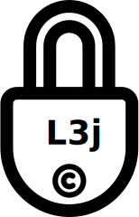
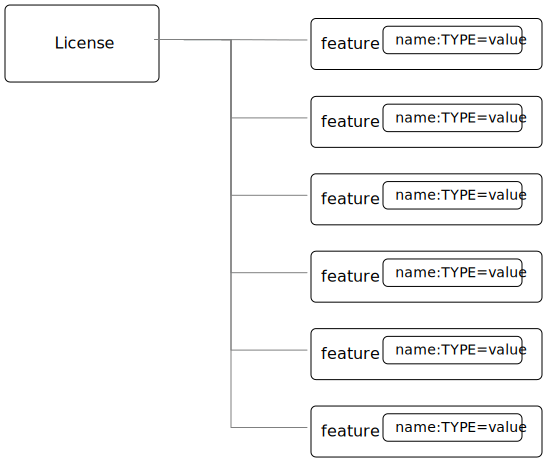
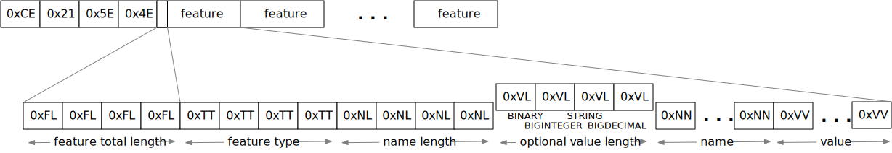

# License3j Free License management for Java



License3j is a free and open source Java library to manage license files in Java programs that need technical license management enforcement support.
A license file is a special configuration file, which is electronically signed.
The library can create, sign such license files and can also check the signature and parameters of the license file when embedded into the licensed application.

## Introduction

License3j is a Java library that can be used to create and assert license files.
This way Java programs can enforce the users to compensate their use of the software in the form of payment.
This is the usual way when closed source programs are distributed.

License management alone does not guarantee that the program will not be stolen, pirated or used in any illegal way.
However, license management may increase the difficulty to use the program illegally and therefore may drive users to become customers.
There is another effect of license management which is a legal aspect.
If there is sufficient license management, illegal users have less probability to successfully claim their use was based on the lack of, or on false knowledge of license conditions.

License3j is an open source license manager that you can use free of charge for non-profit purposes...

as well as for profit purposes as well under the license terms covered by Apache 2.0 license as defined on the web page http://www.apache.org/licenses/LICENSE-2.0

## JavaDoc

https://verhas.github.io/License3j/

## In short

The following code fragment shows the structure you have to program to check the license:

```java

// load the license using a license reader
try (var reader = new LicenseReader('license.bin')) {
    License license = reader.read();
} catch (IOException e) {
    error("Error reading license file " + e);
}

// encode the public key into your application
// (you can copy paste this from License3jRepl after key generation, see later)
byte [] key = new byte[] {
    (byte)0x30, 
    (byte)0x81, (byte)0x9F, (byte)0x30, (byte)0x0D, (byte)0x06, (byte)0x09, (byte)0x2A, (byte)0x86, 
    (byte)0x48, (byte)0x86, (byte)0xF7, (byte)0x0D, (byte)0x01, (byte)0x01, (byte)0x01, (byte)0x05, 
    (byte)0x00, (byte)0x03, (byte)0x81, (byte)0x8D, (byte)0x00, (byte)0x30, (byte)0x81, (byte)0x89, 
    
    ... some lines are deleted as actual values are irrelevant ...
    
    (byte)0xE3, (byte)0xBB, (byte)0xE3, (byte)0xB1, (byte)0x67, (byte)0xAC, (byte)0x2A, (byte)0x9D, 
    (byte)0x9D, (byte)0x67, (byte)0xB0, (byte)0x9D, (byte)0x3A, (byte)0xDE, (byte)0x48, (byte)0xA5, 
    (byte)0x2A, (byte)0xE8, (byte)0xBB, (byte)0xC6, (byte)0xE2, (byte)0x39, (byte)0x0D, (byte)0x41, 
    (byte)0xDF, (byte)0x76, (byte)0xD0, (byte)0xA7, (byte)0x02, (byte)0x03, (byte)0x01, (byte)0x00, 
    (byte)0x01, 
    };
// check that the license is signed properly
if( !license.isOK(key) ){
    // if not signed, stop the application
    return;
}
// get a feature and from the feature type specific data, like date, int, long, String...
Date birthday = license.get("bd").getDate();

```

Create keys, license and sign license using a text editor, and/or the REPL application (see below).


## What is a license in License3j



A license in License3j is a collection of features. Each feature has

* a name,
* a type, and
* a value.

The name can be any string you like, but there are some predefined names that have special meaning for the license management library.
The type of a feature can be

<table><tr><td>


</td><td>

* `BINARY` can contain an arbitrary binary value that is retrieved by the Java code as a `byte[]` array
* `STRING` can contain any string, will be retrieved as `java.lang.String`
* `BYTE` contains a single byte value.
* `SHORT` contains a single short value
* `INT` contains an integer (`int`) value
* `LONG` contains a long value
* `FLOAT` contains a float value
* `DOUBLE` contains a double value
* `BIGINTEGER` contains a big integer value
* `BIGDECIMAL` contains a big decimal value
* `DATE` contains a date value 
* `UUID` contains a UUID value

</td></tr></table>

The value of the different features can be retrieved as the corresponding Java object or a primitive value.
There is no automatic conversion between the different types of the features.

When the license is saved to a file it can be saved binary, base64 or text.

* `BINARY` format is suitable to store in a file. This is also the shortest, most compact format of the license. It may
  not be suitable to be sent over the internet inside and eMail and is not directly editable.
  
* `BASE64` format is the same as the binary format, but it is encoded using the base64 encoding

* `TEXT` format is a human readable format, suitable for editing in a text editor, looking at the actual content of the
  license without any special tool. The text format is always encoded UTF-8 character set.

All three formats are suitable to store the license information and when a program is protected using License3j it can be programmed to read only one, two and all three formats.
The license object created in the JVM memory as a result of reading the license file is the same independent of the source format.

When a program is protected using License3j the application has a small code fragment that checks the existence of a license file, the validity of the license and it can also use the parameters encoded in the license as license features.

## Load a license from a file

To read a license from a file you need a `javax0.license3j.io.LicenseReader` object

```java
try (var reader = new LicenseReader('license.bin')) {
    License license = reader.read();
} catch (IOException e) {
    error("Error reading license file " + e);
}
```

This will read the license from the file `license.bin` assuming the license is there binary formatted.
In case the license file is not readable or has a different format either `IOException` or `IllegalArgumentException` will be thrown.
If the license is not binary then the code should use the read method with the format parameter either `reader.read(IOFormat.STRING)` or `reader.read(IOFormat.BASE64)`.

## Check signature on the license

The license is read from the file even if it is not signed.
A license can be signed, unsigned or it may have a compromised signature.
Reading the license does not check either the existence of the signature nor the validity of that.
To check the existence, and the validity of the signature the application needs the public key.
Licenses are signed using public key cryptography, where a private key is used to sign the license.
The corresponding public key is used to check the authenticity of the signature.
The public key can be read from a file, or it can be hard-coded in the application.
The latter is recommended.

To embed the public key into the application you have to have a public key at the first place.
To create a key pair you should start the interactive application available from a separate project at https://github.com/verhas/license3jrepl

```
$ java -jar license3jrepl.jar
``` 

This will start with an interactive prompt where you can enter commands.
The prompt you will see is `L3j> $ `.

To generate a key pair you have to enter the command:

```
generateKeys algorithm=RSA size=1024 format=BINARY public=public.key private=private.key
```

This will generate the public and the private keys and save them into the files `public.key` and `private.key`.
The keys also remain loaded into the REPL application.
To embed this key into the application you can execute the command `dumpPublicKey` that will dump the Java code to the screen, something like:

```java
--KEY DIGEST START
byte [] digest = new byte[] {
(byte)0xA1, 
(byte)0x04, (byte)0x1D, (byte)0x2C, (byte)0xF1, (byte)0x56, (byte)0xFB, (byte)0x06, (byte)0x43, 

... some lines are deleted as actual values are irrelevant ...

(byte)0x98, (byte)0xB6, (byte)0xD9, (byte)0x60, (byte)0x51, (byte)0x9E, (byte)0xA2, 
};
---KEY DIGEST END
--KEY START
byte [] key = new byte[] {
(byte)0x30, 
(byte)0x81, (byte)0x9F, (byte)0x30, (byte)0x0D, (byte)0x06, (byte)0x09, (byte)0x2A, (byte)0x86, 
(byte)0x48, (byte)0x86, (byte)0xF7, (byte)0x0D, (byte)0x01, (byte)0x01, (byte)0x01, (byte)0x05, 
(byte)0x00, (byte)0x03, (byte)0x81, (byte)0x8D, (byte)0x00, (byte)0x30, (byte)0x81, (byte)0x89, 

... some lines are deleted as actual values are irrelevant ...

(byte)0xE3, (byte)0xBB, (byte)0xE3, (byte)0xB1, (byte)0x67, (byte)0xAC, (byte)0x2A, (byte)0x9D, 
(byte)0x9D, (byte)0x67, (byte)0xB0, (byte)0x9D, (byte)0x3A, (byte)0xDE, (byte)0x48, (byte)0xA5, 
(byte)0x2A, (byte)0xE8, (byte)0xBB, (byte)0xC6, (byte)0xE2, (byte)0x39, (byte)0x0D, (byte)0x41, 
(byte)0xDF, (byte)0x76, (byte)0xD0, (byte)0xA7, (byte)0x02, (byte)0x03, (byte)0x01, (byte)0x00, 
(byte)0x01, 
};
---KEY END
```

The digest is the SHA-512 digest of the public key.
If you want to arrange your code so that it loads the public key from a file or from some external resource you can check the key against the stored digest.
This ensures that the key is really the one to use to check the signature.
The recommended way, however, is to copy and paste into your application the second array, which is the actual public key.

Having a loaded license and the public key it is fairly straightforward to check the validity of the license.
All you have to invoke is

```java
license.isOK(key)
```

This call will return true if the license is signed, and the license signature can be verified using the `key` argument.
If this call returns false, the license should not be used as a reliable source for usage rights configuration.

When the license is verified the features can be retrieved using the names of the features.
The call to `license.get(name)` will return the feature object of the name `name`.
To get the actual value of the feature you can call `feature.getXxx()` where `Xxx` is the feature type.
You can also check the type of a feature calling one of the `feature.isXxx()` but, honestly, your code has to know it.
You create the license, and you check the license is intact using digital signature before calling any of the `getXxx()` methods, thus it is not likely you try to fetch the wrong type unless you have a bug in your code.

## License formats



### License Binary and Base64

Binary and base64 formats are essentially the same.
The Base64 format is the same as the binary, only it is encoded using the base64 encoding to ensure that only printable characters are in the license.
Neither of the forms is directly readable by a human using a simple text editor. You can however, read and convert any of the formats using the REPL application (mentioned above).

### Magic bytes

The binary representation of the license starts with the bytes `0xCE`, `0x21`, `0x5E`, `0x4E`.
This is the serialized format of the Java Integer value `0x21CE4E5E` that stands for `21` -> `LI`, `CE` itself, `4E` -> `N` (ASCII), `5E` -> `SE` and reads together as `LICENSE`.
It is a bit lame but gives a bit of joy to the game and prevents accidental loading of non-license files.
Since the sizes and the types are stored on four bytes as Integers very large files could be loaded accidentally.

If the loading of too large files is a concern there are size limiting constructors for the class `LicenseReader`.
Using that constructor the read of large files will be aborted before it would eat up Java memory.

### Feature length 4bytes

The magic bytes are followed by the features in binary format. The length of the feature encoded on 4 bytes precedes the feature.

### Feature type 4bytes

The feature starts with the type of the feature also in 4 bytes. Since there are a limited amount of types there is plenty of room for introducing new types.

### Name length 4bytes

This is followed by the length of the name also in 4 bytes.

### Value length 4bytes (optional)

Some of the types have fixed length. If the type is a fixed length then the value directly follows and the four bytes of the length, which is known anyway, is not present in the file.
If the value for the given type can be variable length then the length of the value is followed on 4 bytes.

Currently only `BINARY`, `STRING`, `BIGINTEGER` and `BIGDECIMAL` types have variable length.

### Name and value

This is followed by the actual bytes that encode the value of the feature.

### License Text

The textual format of the license is text, obviously, encoded using the UTF-8 character set.
Each line in the file is a feature, or a feature continuation line in case the feature value is represented on multiple lines.

A line describing a feature starts with the name of the feature.
This is followed by the type of the feature separated by a `:` from the name. The type is written in all capital letters as listed above `BINARY`, `STRING`, `BYTE` etc.
The type is followed by a `=` and then comes the value of the feature. The type, along with the separating `:` can be
missing in case it is `STRING`. (Note that there was a bug prior the version 3.1.5 that did not allow the use of string
values that contained `:` characters, unless the explicit `:STRING` followed the name of the string feature.)

When a `DATE` feature is converted to and from text then the actual value should be interpreted as time zone independent
value. (Note that there was a bug in 3.X.X releases prior the version 3.1.1 that used the local time zone to interpret
text representation of the date/time values.)

The values are encoded as text in a human-readable and editable way. When a value cannot fit on a single line, for
example, a multi-line string, then the feature value starts with the characters `<<` and it is followed by a string till
the end of the line which does not appear in the value. The following lines contain the value of the feature until a
line contains the string, which was after the `<<` characters on the start line. This is similar to the "here string"
syntax of UNIX shell.

## License3j REPL application

The repl application is NOT part of the `license3j.jar` file. It is available as a separate JAR from
https://github.com/verhas/license3jrepl. To start the repl (Read Evaluate Print Loop) using the Java command:

```
$ java -jar license3jrepl.jar
``` 

You do not need any other library or class on the classpath.

The application is interactive, and it reads the commands from the console and writes the output to the standard output.
If the console is not available then it uses the standard input. The prompt it displays is:

```
License3j REPL
CDW is /Users/verhasp/Dropbox/github/License3j/.
help for help
L3j> $ 
```

The simplest command you can type in is `help`:

```
L3j> $ help
License is not loaded.
Keys are not loaded
[INFO] Use ! to execute shell commands
[INFO] !cd has no effect, current working directory cannot be changed
[INFO] exit to exit
[INFO] other commands:
[INFO]     help 
[INFO]     feature name:TYPE=value
[INFO]     licenseLoad [format=TEXT*|BINARY|BASE64] fileName
[INFO]     saveLicense [format=TEXT*|BINARY|BASE64] fileName
[INFO]     loadPrivateKey [format=BINARY|BASE64] keyFile=xxx
[INFO]     loadPublicKey [format=BINARY|BASE64] keyFile=xxx
[INFO]     sign [digest=SHA-512]
[INFO]     verify >>no argument<<
[INFO]     generateKeys [algorithm=RSA] [size=2048] [format=BINARY|BASE64] public=xxx private=xxx
[INFO]     newLicense >>no argument<<
[INFO]     dump >>no argument<<
[INFO]     digestPublicKey >>no argument<<
[INFO] For more information read the documentation
```

Note that the actual output of the command `help` may be different for different versions of the program and from what
you actually can see in this documentation.

You can exit the application using the command `exit`. You can execute external commands using the `!` mark. Any string
you type on a line that starts with the `!` character will be passed to the underlying operating system, and it will be
executed. You can, for example , type `!ls` on Linux to see what files are there in the current working directory, or
you can type `!dir` to do the same under Windows. You cannot change the current working directory this way. You can
issue the command `cd other_dir` and it actually will change the current working directory but only for the new shell,
which is executing the command and not for the process that executes the Repl application. It means that as soon as the
command has finished and returns to the repl application the current working directory is restored to the original
value.

When you execute the Repl you can create a new license, new key pair, you can save them to files, or you can load them
from files. The commands work with the keys using the license that is currently in the memory. The information is also
printed on the screen about the license and the key. When you start the Repl there is no license or keys loaded.

You can type the commands interactively, or you can type a file name as a command following a `.` (dot) character. The
Repl application will read the file line by line and execute the lines as they were typed into the interactive prompt.

If there is a file `.license3j` in the current working directory when the Repl is started then it will be read and
executed automatically. This can be used to load the default public and private keys that you usually work with.

The commands can be abbreviated. You need to write only so many characters so that the command can uniquely be
identified. The same is true for the command parameters that have names. Thus you can type `si` instead of `sign` to
sign a license.

Older versions of License3j included the Repl application. The current and later versions of License3j will not include
the Repl application. The Repl application is moved to a separate application. It uses the `javax0.repl` library as a
framework. This solution provides a leaner license3j library that you include into your application. Your application
will not contain the code of the License3j Repl application and of the libraries that it uses. Moving the repl framework
to a separate library makes it more viable and can be used by other Java applications as well.

No matter which version you use following 3.0.0 there will be a Repl application available to manage the licenses and
the keys.

## Download and Installation

The License3j module can be downloaded from the Sonatype central repository. To search the central repo follow the URL
`http://central.sonatype.org/`

If you use maven you can insert the lines

```
<dependency>
    <groupId>com.javax0.license3j</groupId>
    <artifactId>license3j</artifactId>
    <version>3.1.5</version>
</dependency>
```

in to your `pom.xml` file. Check the central repository for the latest version.

## Note on release history

License3j versions 1.x.x and 2.0.0 were released for Java 1.5 ... 1.8. The release 3.0.0 is a total rewrite of the
library. Neither the API nor the binary formats are compatible with previous versions. It is also released only for Java
11 and later and there is no planned backport release for Java 8 or earlier. Note however that the generated byte code
is compatible with Java 8 JVM, so you can use the library as a dependency for Java 8 projects. This may change in later
releases.

License3j prior to version 3.0.0 has a dependency on the Bouncy Castle encryption library. The version 3.0.0 and later
breaks this dependency and this version is standalone. Also, this version can be used to generate the keys, sign
licenses and does not need the external gpg tool. (Also note that you cannot use the gpg tool to generate keys for this
version as the format of the keys are not compatible with older versions.)

## Name of the game

There are many names that contain '2'. In these cases '2' stands for 'to' instead of 'two'. There are names containing
'4' that stands for 'for'. For example license4j.

'3' in license3j stands for 'free' instead of 'three'. Because this is a free program.

## Related projects

https://github.com/shevek/gradle-license3j-plugin
https://github.com/lkollar/license3j-docker

 
