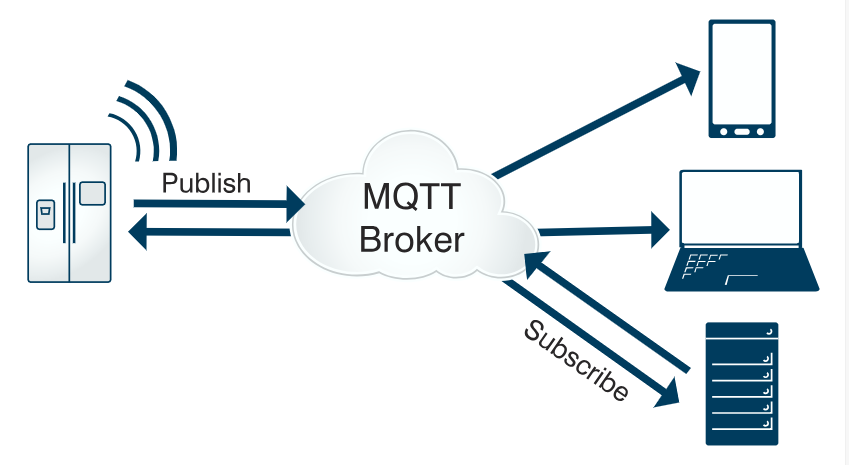

# SpringBoot 集成 MQTT



  文中提到的MQTT服务器Apache-Apollo，现在已经不维护。但是客户端的写法是通用的。用其它mq服务器写法一样，比如RabbitMQ+MQTT。

## MQTT 介绍

- (1) MQTT（Message Queuing Telemetry Transport，消息队列遥测传输）是 IBM 开发的一个即时通讯协议，它是一种轻量级的、基于代理的“发布/订阅”模式的消息传输协议。
- (2) MQTT 具有协议简洁、小巧、可扩展性强、省流量、省电等优点，比较适合于在低带宽、不可靠的网络的进行远程传感器和控制设备通讯等，正在日益成为物联网通信协议的重要组成部分。
- (3) MQTT 是ISO标准（ISO/IEC PRF 20922）下基于发布/订阅范式的消息协议。它工作在 TCP/IP协议族上，是为硬件性能低下的远程设备以及网络状况糟糕的情况下而设计的发布/订阅型消息协议。

### MQTT协议运行在TCP/IP或其他网络协议，提供有序、无损、双向连接。其特点包括：

- 1.使用的发布/订阅消息模式，它提供了一对多消息分发，以实现与应用程序的解耦。
- 2.对负载内容屏蔽的消息传输机制。
- 3.对传输消息有三种服务质量（QoS）：
    - 最多一次，这一级别会发生消息丢失或重复，消息发布依赖于底层TCP/IP网络。即：<=1
    - 至多一次，这一级别会确保消息到达，但消息可能会重复。即：>=1
    - 只有一次，确保消息只有一次到达。即：＝1。在一些要求比较严格的计费系统中，可以使用此级别
- 4.数据传输和协议交换的最小化（协议头部只有2字节），以减少网络流量
- 5.通知机制，异常中断时通知传输双方

## Apache-Apollo

Apache Apollo是一个代理服务器，其是在ActiveMQ基础上发展而来的，可以支持STOMP, AMQP, MQTT, Openwire, SSL, WebSockets 等多种协议。
原理：服务器端创建一个唯一订阅号，发送者可以向这个订阅号中发东西，然后接受者（即订阅了这个订阅号的人）都会收到这个订阅号发出来的消息。以此来完成消息的推送。服务器其实是一个消息中转站。

### 下载

下载地址：http://archive.apache.org/dist/activemq/activemq-apollo/

### 配置与启动

 - 1.需要安装JDK环境
 - 2.在命令行模式下进入bin，执行apollo create broker E:\MQTT\apache_apollo\broker，创建一个名为broker虚拟主机（Virtual Host）。需要特别注意的是，生成的目录就是以后真正启动程序的位置。
 - 3.在命令行模式下进入E:\MQTT\apache_apollo\broker\bin，执行apollo-broker run，也可以用apollo-broker-service.exe配置成后台服务。
 - 4.访问http://127.0.0.1:61680打开web管理界面。（密码查看broker/etc/users.properties）
 - 5.启动端口，看cmd输出。

## SpringBoot的开发

### 公共部分

#### 添加依赖 pom.xml

```xml
<?xml version="1.0" encoding="UTF-8"?>
<project xmlns="http://maven.apache.org/POM/4.0.0" xmlns:xsi="http://www.w3.org/2001/XMLSchema-instance"
         xsi:schemaLocation="http://maven.apache.org/POM/4.0.0 http://maven.apache.org/xsd/maven-4.0.0.xsd">
    <modelVersion>4.0.0</modelVersion>

    <parent>
        <artifactId>mqtt</artifactId>
        <groupId>com.easy</groupId>
        <version>1.0</version>
    </parent>

    <groupId>com.easy</groupId>
    <artifactId>mqtt-subscriber</artifactId>
    <version>1.0</version>
    <packaging>jar</packaging>

    <name>mqtt-subscriber</name>
    <description>Demo project for Spring Boot</description>

    <properties>
        <project.build.sourceEncoding>UTF-8</project.build.sourceEncoding>
        <java.version>1.8</java.version>
    </properties>

    <dependencies>
        <!--mqtt相关依赖 start-->
        <dependency>
            <groupId>org.springframework.integration</groupId>
            <artifactId>spring-integration-stream</artifactId>
        </dependency>
        <dependency>
            <groupId>org.springframework.integration</groupId>
            <artifactId>spring-integration-mqtt</artifactId>
        </dependency>
        <!--mqtt相关依赖 end-->

        <dependency>
            <groupId>org.springframework.boot</groupId>
            <artifactId>spring-boot-starter-web</artifactId>
        </dependency>
        <dependency>
            <groupId>org.projectlombok</groupId>
            <artifactId>lombok</artifactId>
        </dependency>
    </dependencies>

</project>
```

#### 项目配置 application.yml

```yaml
# Mqtt配置
mqtt:
  serverURIs: tcp://127.0.0.1:61613
  username: admin
  password: password
  client:
    id: ${random.value}
  topic: topic_default
```

### 发布者 mqtt-publisher 项目(端口：8081)

#### 创建配置代码 MqttPublisherConfig.java

```java
package com.easy.mqtt.publisher.config;

import lombok.Getter;
import lombok.Setter;
import lombok.extern.slf4j.Slf4j;
import org.eclipse.paho.client.mqttv3.MqttConnectOptions;
import org.springframework.beans.factory.annotation.Value;
import org.springframework.context.annotation.Bean;
import org.springframework.context.annotation.Configuration;
import org.springframework.integration.annotation.IntegrationComponentScan;
import org.springframework.integration.annotation.ServiceActivator;
import org.springframework.integration.channel.DirectChannel;
import org.springframework.integration.core.MessageProducer;
import org.springframework.integration.mqtt.core.DefaultMqttPahoClientFactory;
import org.springframework.integration.mqtt.core.MqttPahoClientFactory;
import org.springframework.integration.mqtt.inbound.MqttPahoMessageDrivenChannelAdapter;
import org.springframework.integration.mqtt.outbound.MqttPahoMessageHandler;
import org.springframework.integration.mqtt.support.DefaultPahoMessageConverter;
import org.springframework.messaging.MessageChannel;
import org.springframework.messaging.MessageHandler;

import javax.annotation.PostConstruct;
import java.util.Objects;

@Slf4j
@Configuration
@IntegrationComponentScan
@Getter
@Setter
public class MqttPublisherConfig {

    public static final String CHANNEL_NAME_OUT = "mqttOutboundChannel";

    // 客户端与服务器之间的连接意外中断，服务器将发布客户端的“遗嘱”消息
    private static final byte[] WILL_DATA;

    static {
        WILL_DATA = "offline".getBytes();
    }

    @Value("${mqtt.username}")
    private String username;

    @Value("${mqtt.password}")
    private String password;

    @Value("${mqtt.serverURIs}")
    private String hostUrl;

    @Value("${mqtt.client.id}")
    private String clientId;

    @Value("${mqtt.topic}")
    private String defaultTopic;

    @PostConstruct
    public void init() {
        log.debug("username:{} password:{} hostUrl:{} clientId :{} ",
                this.username, this.password, this.hostUrl, this.clientId, this.defaultTopic);
    }

    /**
     * MQTT连接器选项
     *
     * @return
     */
    @Bean
    public MqttConnectOptions getSenderMqttConnectOptions() {
        MqttConnectOptions options = new MqttConnectOptions();
        // 设置连接的用户名
        if (!username.trim().equals("")) {
            options.setUserName(username);
        }
        // 设置连接的密码
        options.setPassword(password.toCharArray());
        // 设置连接的地址
        options.setServerURIs(new String[]{hostUrl});
        // 设置超时时间 单位为秒
        options.setConnectionTimeout(10);
        // 设置会话心跳时间 单位为秒 服务器会每隔1.5*20秒的时间向客户端发送心跳判断客户端是否在线
        // 但这个方法并没有重连的机制
        options.setKeepAliveInterval(20);
        // 设置“遗嘱”消息的话题，若客户端与服务器之间的连接意外中断，服务器将发布客户端的“遗嘱”消息。
        options.setWill("willTopic", WILL_DATA, 2, false);
        return options;
    }

    /**
     * MQTT客户端
     */
    @Bean
    public MqttPahoClientFactory senderMqttClientFactory() {
        DefaultMqttPahoClientFactory factory = new DefaultMqttPahoClientFactory();
        factory.setConnectionOptions(getSenderMqttConnectOptions());
        return factory;
    }

    /**
     * MQTT信息通道（生产者）
     */
    @Bean(name = CHANNEL_NAME_OUT)
    public MessageChannel mqttOutboundChannel() {
        return new DirectChannel();
    }

    /**
     * MQTT消息处理器（生产者）
     */
    @Bean
    @ServiceActivator(inputChannel = CHANNEL_NAME_OUT)
    public MessageHandler mqttOutbound() {
        MqttPahoMessageHandler messageHandler = new MqttPahoMessageHandler(
                clientId,
                senderMqttClientFactory());
        messageHandler.setAsync(true);
        messageHandler.setDefaultTopic(defaultTopic);
        return messageHandler;
    }
}

```

#### 消息发布器 MqttGateway.java

```java
package com.easy.mqtt.publisher.config;

import org.springframework.integration.annotation.MessagingGateway;
import org.springframework.integration.mqtt.support.MqttHeaders;
import org.springframework.messaging.handler.annotation.Header;
import org.springframework.stereotype.Component;

@Component
@MessagingGateway(defaultRequestChannel = MqttPublisherConfig.CHANNEL_NAME_OUT)
public interface MqttGateway {

    /**
     * 发送信息到MQTT服务器
     *
     * @param payload 发送的文本
     */
    void sendToMqtt(String payload);

    /**
     * 发送信息到MQTT服务器
     *
     * @param topic   主题
     * @param payload 消息主体
     */
    void sendToMqtt(@Header(MqttHeaders.TOPIC) String topic, String payload);

    /**
     * 发送信息到MQTT服务器
     *
     * @param topic   主题
     * @param qos     对消息处理的几种机制。
     *                0 表示的是订阅者没收到消息不会再次发送，消息会丢失。
     *                1 表示的是会尝试重试，一直到接收到消息，但这种情况可能导致订阅者收到多次重复消息。
     *                2 多了一次去重的动作，确保订阅者收到的消息有一次。
     * @param payload 消息主体
     */
    void sendToMqtt(@Header(MqttHeaders.TOPIC) String topic,
                    @Header(MqttHeaders.QOS) int qos,
                    String payload);
}
```

#### 测试代码 MqttTestController.java

```java
package com.easy.mqtt.publisher.controller;

import com.easy.mqtt.publisher.config.MqttGateway;
import lombok.extern.slf4j.Slf4j;
import org.springframework.http.HttpStatus;
import org.springframework.http.MediaType;
import org.springframework.http.ResponseEntity;
import org.springframework.web.bind.annotation.PostMapping;
import org.springframework.web.bind.annotation.RequestParam;
import org.springframework.web.bind.annotation.ResponseBody;
import org.springframework.web.bind.annotation.RestController;

import javax.annotation.Resource;

/**
 * MQTT消息发送
 */
@RestController
@Slf4j
public class MqttTestController {
    /**
     * 注入发送MQTT的Bean
     */
    @Resource
    private MqttGateway mqttGateway;

    /**
     * 发送自定义消息内容（使用默认主题）
     *
     * @param msg 消息内容
     * @return 返回
     */
    @ResponseBody
    @PostMapping(value = "/sendMqtt", produces = MediaType.APPLICATION_JSON_VALUE)
    public ResponseEntity<String> sendMqtt(@RequestParam(value = "msg") String msg) {
        log.info("================生产默认主题的MQTT消息===={}============", msg);
        mqttGateway.sendToMqtt(msg);
        return new ResponseEntity<>("发送成功", HttpStatus.OK);
    }

    /**
     * 发送自定义消息内容，且指定主题
     *
     * @param msg 消息内容
     * @return 返回
     */
    @ResponseBody
    @PostMapping(value = "/sendMqtt2", produces = MediaType.APPLICATION_JSON_VALUE)
    public ResponseEntity<String> sendMqtt2(@RequestParam("topic") String topic, @RequestParam(value = "msg") String msg) {
        log.info("================生产自定义主题的MQTT消息===={}============", msg);
        mqttGateway.sendToMqtt(topic, msg);
        return new ResponseEntity<>("发送成功", HttpStatus.OK);
    }
}
```

### 订阅者 mqtt-subscriber 项目（端口：8082）

#### 创建配置代码 MqttSubscriberConfig.java

```java
package com.easy.mqtt.subscriber.config;

import lombok.Getter;
import lombok.Setter;
import lombok.extern.slf4j.Slf4j;
import org.eclipse.paho.client.mqttv3.MqttConnectOptions;
import org.springframework.beans.factory.annotation.Value;
import org.springframework.context.annotation.Bean;
import org.springframework.context.annotation.Configuration;
import org.springframework.integration.annotation.IntegrationComponentScan;
import org.springframework.integration.annotation.ServiceActivator;
import org.springframework.integration.channel.DirectChannel;
import org.springframework.integration.core.MessageProducer;
import org.springframework.integration.mqtt.core.DefaultMqttPahoClientFactory;
import org.springframework.integration.mqtt.core.MqttPahoClientFactory;
import org.springframework.integration.mqtt.inbound.MqttPahoMessageDrivenChannelAdapter;
import org.springframework.integration.mqtt.support.DefaultPahoMessageConverter;
import org.springframework.messaging.Message;
import org.springframework.messaging.MessageChannel;
import org.springframework.messaging.MessageHandler;
import org.springframework.messaging.MessagingException;

@Slf4j
@Configuration
@IntegrationComponentScan
@Getter
@Setter
public class MqttSubscriberConfig {
    /**
     * 订阅的bean名称
     */
    public static final String CHANNEL_NAME_IN = "mqttInboundChannel";

    // 客户端与服务器之间的连接意外中断，服务器将发布客户端的“遗嘱”消息
    private static final byte[] WILL_DATA;

    static {
        WILL_DATA = "offline".getBytes();
    }

    @Value("${mqtt.username}")
    private String username;

    @Value("${mqtt.password}")
    private String password;

    @Value("${mqtt.serverURIs}")
    private String hostUrl;

    @Value("${mqtt.client.id}")
    private String clientId;

    @Value("${mqtt.topic}")
    private String defaultTopic;

    /**
     * MQTT连接器选项
     */
    @Bean
    public MqttConnectOptions getReceiverMqttConnectOptions() {
        MqttConnectOptions options = new MqttConnectOptions();
        // 设置连接的用户名
        if (!username.trim().equals("")) {
            options.setUserName(username);
        }
        // 设置连接的密码
        options.setPassword(password.toCharArray());
        // 设置连接的地址
        options.setServerURIs(new String[]{hostUrl});
        // 设置超时时间 单位为秒
        options.setConnectionTimeout(10);
        // 设置会话心跳时间 单位为秒 服务器会每隔1.5*20秒的时间向客户端发送心跳判断客户端是否在线
        // 但这个方法并没有重连的机制
        options.setKeepAliveInterval(20);
        return options;
    }

    /**
     * MQTT客户端
     */
    @Bean
    public MqttPahoClientFactory receiverMqttClientFactory() {
        DefaultMqttPahoClientFactory factory = new DefaultMqttPahoClientFactory();
        factory.setConnectionOptions(getReceiverMqttConnectOptions());
        return factory;
    }

    /**
     * MQTT信息通道（消费者）
     */
    @Bean(name = CHANNEL_NAME_IN)
    public MessageChannel mqttInboundChannel() {
        return new DirectChannel();
    }


    /**
     * MQTT消息订阅绑定（消费者）
     */
    @Bean
    public MessageProducer inbound() {
        // 可以同时消费（订阅）多个Topic
        MqttPahoMessageDrivenChannelAdapter adapter =
                new MqttPahoMessageDrivenChannelAdapter(clientId, receiverMqttClientFactory(),
                        new String[]{defaultTopic,"yuntian"});
        adapter.setCompletionTimeout(5000);
        adapter.setConverter(new DefaultPahoMessageConverter());
        adapter.setQos(1);
        // 设置订阅通道
        adapter.setOutputChannel(mqttInboundChannel());
        return adapter;
    }

    /**
     * MQTT消息处理器（消费者）
     */
    @Bean
    @ServiceActivator(inputChannel = CHANNEL_NAME_IN)
    public MessageHandler handler() {
        return new MessageHandler() {
            @Override
            public void handleMessage(Message<?> message) throws MessagingException {
                String topic = message.getHeaders().get("mqtt_receivedTopic").toString();
                String msg = message.getPayload().toString();
                log.info("\n--------------------START-------------------\n" +
                        "接收到订阅消息:\ntopic:" + topic + "\nmessage:" + msg +
                        "\n---------------------END--------------------");
            }
        };
    }
}

```

## 运行示例

### 分别运行创建的生产者和订阅者服务

- 1.默认主题发布消息测试

打开postman,post提交url请求（http://localhost:8081/sendMqtt?msg=哈哈哈）或用其它工具提交以下代码
```js
var settings = {
  "url": "http://localhost:8081/sendMqtt?msg=哈哈哈",
  "method": "POST",
  "timeout": 0,
};

$.ajax(settings).done(function (response) {
  console.log(response);
});
```

观察订阅者项目控制台，会有以下消息输出：

```cfml
--------------------START-------------------
接收到订阅消息:
topic:topic_default
message:哈哈哈
---------------------END--------------------
```
表示订阅者成功收到了发布者发布的消息

- 2.自定义主题发布消息测试
  
打开postman,post提交url请求（http://localhost:8081/sendMqtt2?topic=yuntian&msg=哈哈哈）或用其它工具提交以下代码
```js
var settings = {
  "url": "http://localhost:8081/sendMqtt2?topic=yuntian&msg=哈哈哈",
  "method": "POST",
  "timeout": 0,
};

$.ajax(settings).done(function (response) {
  console.log(response);
});
```

观察订阅者项目控制台，会有以下消息输出：

```cfml
--------------------START-------------------
接收到订阅消息:
topic:yuntian
message:哈哈哈
---------------------END--------------------
```
表示订阅者成功收到了发布者发布的yuntian主题消息

### 资料

- [SpringBoot集成MQTT 示例源码](https://github.com/smltq/spring-boot-demo/blob/master/mqtt)
- [原文地址](https://github.com/smltq/spring-boot-demo/blob/master/mqtt/README.md)
- [Spring Boot、Cloud学习示例](https://github.com/smltq/spring-boot-demo)