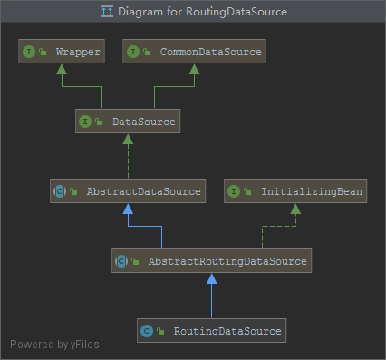

# Spring Boot MyBatis 数据库集群示例（读写分离）

本示例主要介绍了Spring Boot程序方式实现数据库集群访问，读库轮询方式实现负载均衡。阅读本示例前，建议你有[AOP编程基础](https://github.com/smltq/spring-boot-demo/blob/master/aop/HELP.md)、mybatis基本功能会使用、数据库集群基本概念，这样你可以更快的理解和实现它

[本示例源码](https://github.com/smltq/spring-boot-demo/blob/master/mybatis-multi-datasource)

## MySql主从配置

关于配置请参考《[MySQL主从复制配置](https://www.cnblogs.com/cjsblog/p/9706370.html)》

## Spring Boot实现方式

读写分离要做的事情就是对于一条SQL该选择哪个数据库去执行，至于谁来做选择数据库这件事儿，一般来讲，主要有两种实现方式，分别为：

- 1.使用中间件，比如Atlas，cobar，TDDL，mycat，heisenberg，Oceanus，vitess，OneProxy等
- 2.使用程序自己实现，利用Spring Boot提供的路由数据源以及AOP，实现起来简单快捷（本文要介绍的方法）

## 程序代码实现

### 1.首先我们配置下pom.xml，添加示例必要的依赖

```xml
    <dependencies>
        <dependency>
            <groupId>org.springframework.boot</groupId>
            <artifactId>spring-boot-starter-web</artifactId>
        </dependency>
        <dependency>
            <groupId>org.springframework.boot</groupId>
            <artifactId>spring-boot-starter-test</artifactId>
            <scope>test</scope>
        </dependency>
        <dependency>
            <groupId>mysql</groupId>
            <artifactId>mysql-connector-java</artifactId>
            <scope>runtime</scope>
        </dependency>
        <dependency>
            <groupId>org.springframework.boot</groupId>
            <artifactId>spring-boot-starter-jdbc</artifactId>
        </dependency>
        <dependency>
            <groupId>org.projectlombok</groupId>
            <artifactId>lombok</artifactId>
            <optional>true</optional>
        </dependency>
        <dependency>
            <groupId>org.mybatis.spring.boot</groupId>
            <artifactId>mybatis-spring-boot-starter</artifactId>
            <version>2.1.0</version>
        </dependency>
        <dependency>
            <groupId>org.springframework.boot</groupId>
            <artifactId>spring-boot-starter-aop</artifactId>
        </dependency>
    </dependencies>
```

### 2.数据源路由类功能RoutingDataSource.java

基于特定的key路由到特定的数据源。它内部维护了一组目标数据源，并且做了路由key与目标数据源之间的映射，提供基于key查找数据源的方法。

a.类关系图



b.代码很简单,调用下DBContext的get方法就可以了
```java
import org.springframework.jdbc.datasource.lookup.AbstractRoutingDataSource;

public class RoutingDataSource extends AbstractRoutingDataSource {
    @Override
    protected Object determineCurrentLookupKey() {
        return DBContext.get();
    }
}
```

### 3.数据源上下文类DBContext.java

```java
import com.easy.mybatis.multidatasource.enums.DBTypeEnum;
import lombok.extern.slf4j.Slf4j;

import java.util.concurrent.atomic.AtomicInteger;

@Slf4j
public class DBContext {
    private static final ThreadLocal<DBTypeEnum> dbContext = new ThreadLocal<>();

    private static final AtomicInteger counter = new AtomicInteger(-1);

    public static void set(DBTypeEnum dbType) {
        dbContext.set(dbType);
    }

    public static DBTypeEnum get() {
        return dbContext.get();
    }

    public static void master() {
        set(DBTypeEnum.MASTER);
        log.info("切换到master库");
    }

    public static void slave() {
        //  读库负载均衡(轮询方式)
        int index = counter.getAndIncrement() % 2;
        log.info("slave库访问线程数==>{}", counter.get());
        if (index == 0) {
            set(DBTypeEnum.SLAVE1);
            log.info("切换到slave1库");
        } else {
            set(DBTypeEnum.SLAVE2);
            log.info("切换到slave2库");
        }
    }
}

```

### 4.数据库枚举类DBTypeEnum.java

```java
public enum DBTypeEnum {
    MASTER, SLAVE1, SLAVE2
}
```

这里我们配置三个库，分别是一个写库Master，2个读库slave1,slave2

### 5.数据库配置类DataSourceConfig.java

```java
package com.easy.mybatis.multidatasource.config;

import com.easy.mybatis.multidatasource.enums.DBTypeEnum;
import org.springframework.beans.factory.annotation.Qualifier;
import org.springframework.boot.context.properties.ConfigurationProperties;
import org.springframework.boot.jdbc.DataSourceBuilder;
import org.springframework.context.annotation.Bean;
import org.springframework.context.annotation.Configuration;

import javax.sql.DataSource;
import java.util.HashMap;
import java.util.Map;

@Configuration
public class DataSourceConfig {

    @Bean
    @ConfigurationProperties("spring.datasource.master")
    public DataSource masterDataSource() {
        return DataSourceBuilder.create().build();
    }

    @Bean
    @ConfigurationProperties("spring.datasource.slave1")
    public DataSource slave1DataSource() {
        return DataSourceBuilder.create().build();
    }

    @Bean
    @ConfigurationProperties("spring.datasource.slave2")
    public DataSource slave2DataSource() {
        return DataSourceBuilder.create().build();
    }

    @Bean
    public DataSource myRoutingDataSource(@Qualifier("masterDataSource") DataSource masterDataSource,
                                          @Qualifier("slave1DataSource") DataSource slave1DataSource,
                                          @Qualifier("slave2DataSource") DataSource slave2DataSource) {
        Map<Object, Object> targetDataSources = new HashMap<>();
        targetDataSources.put(DBTypeEnum.MASTER, masterDataSource);
        targetDataSources.put(DBTypeEnum.SLAVE1, slave1DataSource);
        targetDataSources.put(DBTypeEnum.SLAVE2, slave2DataSource);
        RoutingDataSource routingDataSource = new RoutingDataSource();
        routingDataSource.setDefaultTargetDataSource(masterDataSource);
        routingDataSource.setTargetDataSources(targetDataSources);
        return routingDataSource;
    }
}

```

### 6.mybatis配置类DataSourceConfig.java

```java
package com.easy.mybatis.multidatasource.config;

import org.apache.ibatis.session.SqlSessionFactory;
import org.mybatis.spring.SqlSessionFactoryBean;
import org.mybatis.spring.annotation.MapperScan;
import org.springframework.context.annotation.Bean;
import org.springframework.context.annotation.Configuration;
import org.springframework.core.io.support.PathMatchingResourcePatternResolver;
import org.springframework.jdbc.datasource.DataSourceTransactionManager;
import org.springframework.transaction.PlatformTransactionManager;
import org.springframework.transaction.annotation.EnableTransactionManagement;

import javax.annotation.Resource;
import javax.sql.DataSource;

@EnableTransactionManagement
@Configuration
@MapperScan("com.easy.mybatis.multidatasource.mapper")
public class MyBatisConfig {

    @Resource(name = "myRoutingDataSource")
    private DataSource myRoutingDataSource;

    @Bean
    public SqlSessionFactory sqlSessionFactory() throws Exception {
        SqlSessionFactoryBean sqlSessionFactoryBean = new SqlSessionFactoryBean();
        sqlSessionFactoryBean.setDataSource(myRoutingDataSource);
        sqlSessionFactoryBean.setMapperLocations(new PathMatchingResourcePatternResolver().getResources("classpath:mapper/*.xml"));
        return sqlSessionFactoryBean.getObject();
    }

    @Bean
    public PlatformTransactionManager platformTransactionManager() {
        return new DataSourceTransactionManager(myRoutingDataSource);
    }
}
```

### 7.切面类DataSourceAop.java

```java
package com.easy.mybatis.multidatasource.config;

import org.aspectj.lang.annotation.Aspect;
import org.aspectj.lang.annotation.Before;
import org.aspectj.lang.annotation.Pointcut;
import org.springframework.stereotype.Component;

@Aspect
@Component
public class DataSourceAop {
    @Pointcut("@annotation(com.easy.mybatis.multidatasource.annotation.Master) " +
            "|| execution(* com.easy.mybatis.multidatasource.service..*.insert*(..)) " +
            "|| execution(* com.easy.mybatis.multidatasource.service..*.add*(..)) " +
            "|| execution(* com.easy.mybatis.multidatasource.service..*.update*(..)) " +
            "|| execution(* com.easy.mybatis.multidatasource.service..*.edit*(..)) " +
            "|| execution(* com.easy.mybatis.multidatasource.service..*.delete*(..)) " +
            "|| execution(* com.easy.mybatis.multidatasource.service..*.remove*(..))")
    public void writePointcut() {

    }

    @Pointcut("!@annotation(com.easy.mybatis.multidatasource.annotation.Master) " +
            "&& (execution(* com.easy.mybatis.multidatasource.service..*.select*(..)) " +
            "|| execution(* com.easy.mybatis.multidatasource.service..*.get*(..)))")
    public void readPointcut() {

    }

    @Before("writePointcut()")
    public void write() {
        DBContext.master();
    }

    @Before("readPointcut()")
    public void read() {
        DBContext.slave();
    }
}
```

### 8.注解类Master.java

```java
package com.easy.mybatis.multidatasource.annotation;

/**
 * 主库，可读写
 */
public @interface Master {
}
```

### 9.用户的xml,mapper,service类

UserMapper.xml
```xml
<?xml version="1.0" encoding="UTF-8"?>
<!DOCTYPE mapper PUBLIC "-//mybatis.org//DTD Mapper 3.0//EN" "http://mybatis.org/dtd/mybatis-3-mapper.dtd">
<mapper namespace="com.easy.mybatis.multidatasource.mapper.UserMapper">
    <select id="selectById" resultType="com.easy.mybatis.multidatasource.entity.User" parameterType="int">
		SELECT * from user WHERE id = #{id}
	</select>
    <select id="selectList" resultType="com.easy.mybatis.multidatasource.entity.User">
		SELECT * from user
	</select>
    <insert id="insert" parameterType="com.easy.mybatis.multidatasource.entity.User">
		INSERT into user(id,name,age,email) VALUES(#{id}, #{name},#{age},#{email})
	</insert>
    <update id="updateById" parameterType="com.easy.mybatis.multidatasource.entity.User">
		UPDATE user SET name =#{name}, age =#{age},email =#{email} WHERE id =#{id}
	</update>
    <delete id="deleteById" parameterType="int">
		DELETE FROM user WHERE id =#{id}
	</delete>
</mapper>

```

UserMapper.java
```java
package com.easy.mybatis.multidatasource.mapper;

import com.easy.mybatis.multidatasource.entity.User;
import org.springframework.stereotype.Repository;

import java.io.Serializable;
import java.util.List;

@Repository
public interface UserMapper {
    /**
     * 插入一条记录
     *
     * @param entity 实体对象
     */
    int insert(User entity);

    /**
     * 根据 ID 删除
     *
     * @param id 主键ID
     */
    int deleteById(Serializable id);

    /**
     * 根据 ID 修改
     *
     * @param entity 实体对象
     */
    int updateById(User entity);

    /**
     * 根据 ID 查询
     *
     * @param id 主键ID
     */
    User selectById(Serializable id);

    List<User> selectList();
}
```

UserServiceImpl.java
```java
package com.easy.mybatis.multidatasource.service.impl;

import com.easy.mybatis.multidatasource.annotation.Master;
import com.easy.mybatis.multidatasource.entity.User;
import com.easy.mybatis.multidatasource.mapper.UserMapper;
import com.easy.mybatis.multidatasource.service.IUserService;
import org.springframework.beans.factory.annotation.Autowired;
import org.springframework.stereotype.Service;

import java.io.Serializable;
import java.util.List;

@Service
public class UserServiceImpl implements IUserService {
    @Autowired
    private UserMapper userMapper;


    /**
     * 插入一条记录
     *
     * @param entity 实体对象
     */
    @Override
    public int insert(User entity) {
        return userMapper.insert(entity);
    }

    /**
     * 根据 ID 删除
     *
     * @param id 主键ID
     */
    @Override
    public int deleteById(Serializable id) {
        return userMapper.deleteById(id);
    }

    /**
     * 根据 ID 修改
     *
     * @param entity 实体对象
     */
    @Override
    public int updateById(User entity) {
        return userMapper.updateById(entity);
    }

    /**
     * 根据 ID 查询
     *
     * @param id 主键ID
     */
    @Master
    @Override
    public User selectById(Serializable id) {
        return userMapper.selectById(id);
    }

    @Override
    public List<User> selectList() {
        return userMapper.selectList();
    }
}
```

这里我们注意到，本来selectById应该访问的是读库（slave库），我这里通过注解的方式，手动把它指到了可写库（master库）

### 10.最后我贴上yaml配置文件application.yml

```yaml
# DataSource Config
spring:
  datasource:
    master:
      driver-class-name: com.mysql.cj.jdbc.Driver
      jdbc-url: jdbc:mysql://localhost:3306/easy_web?useSSL=false&serverTimezone=UTC
      username: root
      password: 123456
    slave1:
      driver-class-name: com.mysql.cj.jdbc.Driver
      jdbc-url: jdbc:mysql://localhost:3306/easy_web?useSSL=false&serverTimezone=UTC
      username: root
      password: 123456
    slave2:
      driver-class-name: com.mysql.cj.jdbc.Driver
      jdbc-url: jdbc:mysql://localhost:3306/easy_web?useSSL=false&serverTimezone=UTC
      username: root
      password: 123456
```

该配置文件配置了三个数据源（这里我为了方便，把三个数据源指到了同个库，实际生产环境会有不同的库和读写用户）

## 编写测试用例，查看执行结果，分析数据库调用情况

### 1.单元测试类MultiDataSourceServiceTest.java

```java
package com.easy.mybatis.multidatasource;

import com.easy.mybatis.multidatasource.entity.User;
import com.easy.mybatis.multidatasource.service.IUserService;
import lombok.extern.slf4j.Slf4j;
import org.junit.FixMethodOrder;
import org.junit.Test;
import org.junit.runner.RunWith;
import org.junit.runners.MethodSorters;
import org.springframework.boot.test.context.SpringBootTest;
import org.springframework.test.context.junit4.SpringRunner;

import javax.annotation.Resource;
import java.util.List;

import static org.assertj.core.api.Assertions.assertThat;

/**
 * <p>
 * 内置 CRUD 演示
 * </p>
 */
@RunWith(SpringRunner.class)
@SpringBootTest
@Slf4j
//指定单元测试按字母顺序执行
@FixMethodOrder(value = MethodSorters.NAME_ASCENDING)
public class MultiDataSourceServiceTest {

    @Resource
    private IUserService userService;

    @Test
    public void aInsert() {
        User user = new User();
        user.setId(20l);
        user.setName("小羊");
        user.setAge(3);
        user.setEmail("abc@mp.com");

        log.info("开始执行insert方法，id={}", user.getId());
        assertThat(userService.insert(user));
        // 成功直接拿会写的 ID
        assertThat(user.getId()).isNotNull();
    }

    @Test
    public void bUpdate() {
        User user = new User();
        user.setId(20l);
        user.setName("小羊update");
        user.setAge(3);
        user.setEmail("abc@mp.com");
        log.info("开始执行updateById方法，id={}", user.getId());
        assertThat(userService.updateById(user) > 0);
    }

    @Test
    public void cSelectById() {
        int id = 20;
        log.info("开始执行selectById方法，id={}", id);
        log.info("数据为=={}", userService.selectById(id));
    }

    @Test
    public void dDelete() {
        int id = 20;
        log.info("开始执行deleteById方法，id={}", id);
        assertThat(userService.deleteById(id));
    }


    @Test
    public void eSelectList() {
        for (int i = 0; i < 5; i++) {
            log.info("开始执行selectList方法，index={}", i);
            List<User> list = userService.selectList();
            log.info("查询到的数据为，list={}", list);
        }
    }
}
```

### 2.查看控制台执行结果

```cfml
2019-08-29 16:36:04.684  INFO 13028 --- [           main] c.e.m.m.MultiDataSourceServiceTest       : Starting MultiDataSourceServiceTest on YHE6OR5UXQJ6D35 with PID 13028 (started by Administrator in E:\project\spring-boot-demo\mybatis-multi-datasource)
2019-08-29 16:36:04.685  INFO 13028 --- [           main] c.e.m.m.MultiDataSourceServiceTest       : No active profile set, falling back to default profiles: default
2019-08-29 16:36:08.172  INFO 13028 --- [           main] o.s.s.concurrent.ThreadPoolTaskExecutor  : Initializing ExecutorService 'applicationTaskExecutor'
2019-08-29 16:36:08.814  INFO 13028 --- [           main] c.e.m.m.MultiDataSourceServiceTest       : Started MultiDataSourceServiceTest in 4.85 seconds (JVM running for 5.918)
2019-08-29 16:36:09.008  INFO 13028 --- [           main] c.e.m.m.MultiDataSourceServiceTest       : 开始执行insert方法，id=20
2019-08-29 16:36:09.018  INFO 13028 --- [           main] c.e.m.multidatasource.config.DBContext   : 切换到master库
2019-08-29 16:36:09.054  INFO 13028 --- [           main] com.zaxxer.hikari.HikariDataSource       : HikariPool-1 - Starting...
2019-08-29 16:36:09.256  INFO 13028 --- [           main] com.zaxxer.hikari.HikariDataSource       : HikariPool-1 - Start completed.
2019-08-29 16:36:09.547  INFO 13028 --- [           main] c.e.m.m.MultiDataSourceServiceTest       : 开始执行updateById方法，id=20
2019-08-29 16:36:09.548  INFO 13028 --- [           main] c.e.m.multidatasource.config.DBContext   : 切换到master库
2019-08-29 16:36:09.731  INFO 13028 --- [           main] c.e.m.m.MultiDataSourceServiceTest       : 开始执行selectById方法，id=20
2019-08-29 16:36:09.732  INFO 13028 --- [           main] c.e.m.multidatasource.config.DBContext   : 切换到master库
2019-08-29 16:36:10.213  INFO 13028 --- [           main] c.e.m.m.MultiDataSourceServiceTest       : 数据为==User(id=20, name=小羊update, age=3, email=abc@mp.com)
2019-08-29 16:36:10.216  INFO 13028 --- [           main] c.e.m.m.MultiDataSourceServiceTest       : 开始执行deleteById方法，id=20
2019-08-29 16:36:10.216  INFO 13028 --- [           main] c.e.m.multidatasource.config.DBContext   : 切换到master库
2019-08-29 16:36:10.402  INFO 13028 --- [           main] c.e.m.m.MultiDataSourceServiceTest       : 开始执行selectList方法，index=0
2019-08-29 16:36:10.403  INFO 13028 --- [           main] c.e.m.multidatasource.config.DBContext   : slave库访问线程数==>0
2019-08-29 16:36:10.403  INFO 13028 --- [           main] c.e.m.multidatasource.config.DBContext   : 切换到slave2库
2019-08-29 16:36:10.405  INFO 13028 --- [           main] com.zaxxer.hikari.HikariDataSource       : HikariPool-2 - Starting...
2019-08-29 16:36:10.418  INFO 13028 --- [           main] com.zaxxer.hikari.HikariDataSource       : HikariPool-2 - Start completed.
2019-08-29 16:36:10.422  INFO 13028 --- [           main] c.e.m.m.MultiDataSourceServiceTest       : 查询到的数据为，list=[User(id=1, name=Jone, age=18, email=ab@c.c), User(id=2, name=mp, age=null, email=miemie2@baomidou.com), User(id=5, name=Billie, age=24, email=test5@tqlin.com)]
2019-08-29 16:36:10.422  INFO 13028 --- [           main] c.e.m.m.MultiDataSourceServiceTest       : 开始执行selectList方法，index=1
2019-08-29 16:36:10.422  INFO 13028 --- [           main] c.e.m.multidatasource.config.DBContext   : slave库访问线程数==>1
2019-08-29 16:36:10.422  INFO 13028 --- [           main] c.e.m.multidatasource.config.DBContext   : 切换到slave1库
2019-08-29 16:36:10.422  INFO 13028 --- [           main] com.zaxxer.hikari.HikariDataSource       : HikariPool-3 - Starting...
2019-08-29 16:36:10.428  INFO 13028 --- [           main] com.zaxxer.hikari.HikariDataSource       : HikariPool-3 - Start completed.
2019-08-29 16:36:10.429  INFO 13028 --- [           main] c.e.m.m.MultiDataSourceServiceTest       : 查询到的数据为，list=[User(id=1, name=Jone, age=18, email=ab@c.c), User(id=2, name=mp, age=null, email=miemie2@baomidou.com), User(id=5, name=Billie, age=24, email=test5@tqlin.com)]
2019-08-29 16:36:10.429  INFO 13028 --- [           main] c.e.m.m.MultiDataSourceServiceTest       : 开始执行selectList方法，index=2
2019-08-29 16:36:10.429  INFO 13028 --- [           main] c.e.m.multidatasource.config.DBContext   : slave库访问线程数==>2
2019-08-29 16:36:10.429  INFO 13028 --- [           main] c.e.m.multidatasource.config.DBContext   : 切换到slave2库
2019-08-29 16:36:10.431  INFO 13028 --- [           main] c.e.m.m.MultiDataSourceServiceTest       : 查询到的数据为，list=[User(id=1, name=Jone, age=18, email=ab@c.c), User(id=2, name=mp, age=null, email=miemie2@baomidou.com), User(id=5, name=Billie, age=24, email=test5@tqlin.com)]
2019-08-29 16:36:10.431  INFO 13028 --- [           main] c.e.m.m.MultiDataSourceServiceTest       : 开始执行selectList方法，index=3
2019-08-29 16:36:10.431  INFO 13028 --- [           main] c.e.m.multidatasource.config.DBContext   : slave库访问线程数==>3
2019-08-29 16:36:10.431  INFO 13028 --- [           main] c.e.m.multidatasource.config.DBContext   : 切换到slave1库
2019-08-29 16:36:10.432  INFO 13028 --- [           main] c.e.m.m.MultiDataSourceServiceTest       : 查询到的数据为，list=[User(id=1, name=Jone, age=18, email=ab@c.c), User(id=2, name=mp, age=null, email=miemie2@baomidou.com), User(id=5, name=Billie, age=24, email=test5@tqlin.com)]
2019-08-29 16:36:10.432  INFO 13028 --- [           main] c.e.m.m.MultiDataSourceServiceTest       : 开始执行selectList方法，index=4
2019-08-29 16:36:10.433  INFO 13028 --- [           main] c.e.m.multidatasource.config.DBContext   : slave库访问线程数==>4
2019-08-29 16:36:10.433  INFO 13028 --- [           main] c.e.m.multidatasource.config.DBContext   : 切换到slave2库
2019-08-29 16:36:10.435  INFO 13028 --- [           main] c.e.m.m.MultiDataSourceServiceTest       : 查询到的数据为，list=[User(id=1, name=Jone, age=18, email=ab@c.c), User(id=2, name=mp, age=null, email=miemie2@baomidou.com), User(id=5, name=Billie, age=24, email=test5@tqlin.com)]
2019-08-29 16:36:10.444  INFO 13028 --- [       Thread-2] o.s.s.concurrent.ThreadPoolTaskExecutor  : Shutting down ExecutorService 'applicationTaskExecutor'
2019-08-29 16:36:10.446  INFO 13028 --- [       Thread-2] com.zaxxer.hikari.HikariDataSource       : HikariPool-2 - Shutdown initiated...
2019-08-29 16:36:10.463  INFO 13028 --- [       Thread-2] com.zaxxer.hikari.HikariDataSource       : HikariPool-2 - Shutdown completed.
2019-08-29 16:36:10.463  INFO 13028 --- [       Thread-2] com.zaxxer.hikari.HikariDataSource       : HikariPool-3 - Shutdown initiated...
2019-08-29 16:36:10.497  INFO 13028 --- [       Thread-2] com.zaxxer.hikari.HikariDataSource       : HikariPool-3 - Shutdown completed.
2019-08-29 16:36:10.497  INFO 13028 --- [       Thread-2] com.zaxxer.hikari.HikariDataSource       : HikariPool-1 - Shutdown initiated...
2019-08-29 16:36:10.500  INFO 13028 --- [       Thread-2] com.zaxxer.hikari.HikariDataSource       : HikariPool-1 - Shutdown completed.
```

- 我们看到service的insert,updateById,deleteById方法执行的是可写库(master库)
- 而selectById方法，因为我们在service使用注解的方式手动切到了master库，所以数据不会去slave库读取了（用来解决有些开发不规范，查询接口带有写库方法的情况）
- selectList方法，我们循环调用了5次，看到结果成功在slave1和slave2轮询读取了

## 资料

- [mybatis-multi-datasource 示例源码](https://github.com/smltq/spring-boot-demo/blob/master/mybatis-multi-datasource)
- [官网数据源配置文档](https://docs.spring.io/spring-boot/docs/current/reference/htmlsingle/#howto-two-datasources)
- [参考资料](https://www.cnblogs.com/cjsblog/p/9712457.html)
- [码云仓库 Spring Boot、Spring Cloud示例学习](https://gitee.com/tqlin/spring-boot-demo.git)
- [GitHub仓库 Spring Boot、Spring Cloud示例学习](https://github.com/smltq/spring-boot-demo.git)