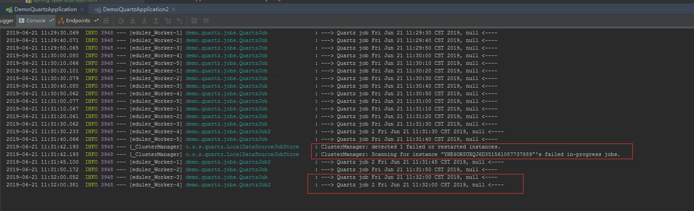

# Spring Boot Quartz

## 主要内容

- Spring Scheduler 框架
- Quartz 框架，功能强大，配置灵活
- Quartz 集群
- mysql 持久化定时任务脚本(tables_mysql.sql)

## 介绍

在工程中时常会遇到一些需求，例如定时刷新一下配置、隔一段时间检查下网络状态并发送邮件等诸如此类的定时任务。
定时任务本质就是一个异步的线程，线程可以查询或修改并执行一系列的操作。由于本质是线程，在 Java 中可以自行编写一个线程池对定时任务进行控制，但这样效率太低了，且功能有限，属于重复造轮子。

## 分布式任务调度应用场景

Quartz的集群功能通过故障转移和负载平衡功能为您的调度程序带来高可用性和可扩展性。

调度程序中会有很多定时任务需要执行，一台服务器已经不能满足使用，需要解决定时任务单机单点故障问题

用Quartz框架，在集群环境下，通过数据库锁机制来实现定时任务的执行；独立的 Quartz 节点并不与另一其的节点或是管理节点通信。

## Spring Scheduler 实现定时任务

### 1.定义 Task 类

```java
/**
 * Spring Scheduled示例
 */
@Component
public class ScheduledTask {

    private static final SimpleDateFormat dateFormat = new SimpleDateFormat("yyyy-MM-dd HH:mm:ss");
    private Integer count0 = 1;
    private Integer count1 = 1;
    private Integer count2 = 1;

    @Scheduled(fixedRate = 5000)
    public void reportCurrentTime() throws InterruptedException {
        System.out.println(String.format("reportCurrentTime第%s次执行，当前时间为：%s", count0++, dateFormat.format(new Date())));
    }

    @Scheduled(fixedDelay = 5000)
    public void reportCurrentTimeAfterSleep() throws InterruptedException {
        System.out.println(String.format("reportCurrentTimeAfterSleep第%s次执行，当前时间为：%s", count1++, dateFormat.format(new Date())));
    }

    @Scheduled(cron = "0 0 1 * * *")
    public void reportCurrentTimeCron() throws InterruptedException {
        System.out.println(String.format("reportCurrentTimeCron第%s次执行，当前时间为：%s", count2++, dateFormat.format(new Date())));
    }
}
```

### 2.启动定时任务

在Spring Boot的主类中加入@EnableScheduling注解，启用定时任务的配置

```java
@RunWith(SpringRunner.class)
@SpringBootTest
@Slf4j
@EnableScheduling
public class ScheduledTaskTests {
    @Test
    public void test() {
        log.info("启动了ScheduledTask定时作业");
        while (true) {
        }
    }
}
```

## quartz实现分布式定时任务

    quartz 是一个开源的分布式调度库，它基于java实现。
    > 它有着强大的调度功能，支持丰富多样的调度方式,比如简单调度，基于cron表达式的调度等等。
    > 支持调度任务的多种持久化方式。比如支持内存存储，数据库存储，Terracotta server 存储。
    > 支持分布式和集群能力。
    > 采用JDBCJobStore方式存储时，针对事务的处理方式支持全局事务（和业务服务共享同一个事务）和局部事务（quarzt 单独管理自己的事务）
    > 基于plugin机制以及listener机制支持灵活的扩展。

### 1.pom.xml配置

```xml
<dependency>
    <groupId>org.springframework.boot</groupId>
    <artifactId>spring-boot-starter-quartz</artifactId>
</dependency>

<!-- mysql -->
<dependency>
    <groupId>mysql</groupId>
    <artifactId>mysql-connector-java</artifactId>
</dependency>

<!-- orm -->
<dependency>
    <groupId>org.springframework.boot</groupId>
    <artifactId>spring-boot-starter-data-jpa</artifactId>
</dependency>
```

### 2.spring-quartz.properties集群配置

```properties
#============================================================================
# 配置JobStore
#============================================================================
# JobDataMaps是否都为String类型，默认false
org.quartz.jobStore.useProperties=false

# 表的前缀，默认QRTZ_
org.quartz.jobStore.tablePrefix = QRTZ_

# 是否加入集群
org.quartz.jobStore.isClustered = true

# 调度实例失效的检查时间间隔 ms
org.quartz.jobStore.clusterCheckinInterval = 5000

# 当设置为“true”时，此属性告诉Quartz 在非托管JDBC连接上调用setTransactionIsolation（Connection.TRANSACTION_READ_COMMITTED）。
org.quartz.jobStore.txIsolationLevelReadCommitted = true

# 数据保存方式为数据库持久化
org.quartz.jobStore.class = org.quartz.impl.jdbcjobstore.JobStoreTX

# 数据库代理类，一般org.quartz.impl.jdbcjobstore.StdJDBCDelegate可以满足大部分数据库
org.quartz.jobStore.driverDelegateClass = org.quartz.impl.jdbcjobstore.StdJDBCDelegate

#============================================================================
# Scheduler 调度器属性配置
#============================================================================
# 调度标识名 集群中每一个实例都必须使用相同的名称
org.quartz.scheduler.instanceName = ClusterQuartz
# ID设置为自动获取 每一个必须不同
org.quartz.scheduler.instanceId= AUTO

#============================================================================
# 配置ThreadPool
#============================================================================
# 线程池的实现类（一般使用SimpleThreadPool即可满足几乎所有用户的需求）
org.quartz.threadPool.class=org.quartz.simpl.SimpleThreadPool

# 指定线程数，一般设置为1-100直接的整数，根据系统资源配置
org.quartz.threadPool.threadCount = 5

# 设置线程的优先级(可以是Thread.MIN_PRIORITY（即1）和Thread.MAX_PRIORITY（这是10）之间的任何int 。默认值为Thread.NORM_PRIORITY（5）。)
org.quartz.threadPool.threadPriority = 5
```

### 3.定义两个job

- QuartzJob.java

```java
//持久化
@PersistJobDataAfterExecution
//禁止并发执行(Quartz不要并发地执行同一个job定义（这里指一个job类的多个实例）)
@DisallowConcurrentExecution
@Slf4j
public class QuartzJob extends QuartzJobBean {
    @Override
    protected void executeInternal(JobExecutionContext context) throws JobExecutionException {
        String taskName = context.getJobDetail().getJobDataMap().getString("name");
        log.info("---> Quartz job {}, {} <----", new Date(), taskName);
    }
}
```

- QuartzJob2.java

```java
@PersistJobDataAfterExecution
@DisallowConcurrentExecution
@Slf4j
public class QuartzJob2 extends QuartzJobBean {

    @Override
    protected void executeInternal(JobExecutionContext context) throws JobExecutionException {
        String taskName = context.getJobDetail().getJobDataMap().getString("name");
        log.info("---> Quartz job 2 {}, {} <----", new Date(), taskName);
    }
}
```

### 4.初始化触发器等信息，这里通过Listener初始化

```java
@Slf4j
public class StartApplicationListener implements ApplicationListener<ContextRefreshedEvent> {
    @Autowired
    SchedulerConfig schedulerConfig;
    public static AtomicInteger count = new AtomicInteger(0);
    private static String TRIGGER_GROUP_NAME = "test_trriger";
    private static String JOB_GROUP_NAME = "test_job";

    @Override
    public void onApplicationEvent(ContextRefreshedEvent event) {
        // 防止重复执行
        if (event.getApplicationContext().getParent() == null && count.incrementAndGet() <= 1) {
            initMyJob();
        }
    }

    public void initMyJob() {
        Scheduler scheduler = null;
        try {
            scheduler = schedulerConfig.scheduler();

            TriggerKey triggerKey = TriggerKey.triggerKey("trigger1", TRIGGER_GROUP_NAME);
            CronTrigger trigger = (CronTrigger) scheduler.getTrigger(triggerKey);
            if (null == trigger) {
                Class clazz = QuartzJob.class;
                JobDetail jobDetail = JobBuilder.newJob(clazz).withIdentity("job1", JOB_GROUP_NAME).build();
                CronScheduleBuilder scheduleBuilder = CronScheduleBuilder.cronSchedule("0/10 * * * * ?");
                trigger = TriggerBuilder.newTrigger().withIdentity("trigger1", TRIGGER_GROUP_NAME)
                        .withSchedule(scheduleBuilder).build();
                scheduler.scheduleJob(jobDetail, trigger);
                log.info("Quartz 创建了job:...:{}", jobDetail.getKey());
            } else {
                log.info("job已存在:{}", trigger.getKey());
            }

            TriggerKey triggerKey2 = TriggerKey.triggerKey("trigger2", TRIGGER_GROUP_NAME);
            CronTrigger trigger2 = (CronTrigger) scheduler.getTrigger(triggerKey2);
            if (null == trigger2) {
                Class clazz = QuartzJob2.class;
                JobDetail jobDetail2 = JobBuilder.newJob(clazz).withIdentity("job2", JOB_GROUP_NAME).build();
                CronScheduleBuilder scheduleBuilder = CronScheduleBuilder.cronSchedule("0/15 * * * * ?");
                trigger2 = TriggerBuilder.newTrigger().withIdentity("trigger2", TRIGGER_GROUP_NAME)
                        .withSchedule(scheduleBuilder).build();
                scheduler.scheduleJob(jobDetail2, trigger2);
                log.info("Quartz 创建了job:...:{}", jobDetail2.getKey());
            } else {
                log.info("job已存在:{}", trigger2.getKey());
            }
            scheduler.start();
        } catch (Exception e) {
            log.info(e.getMessage());
        }
    }
}
```

### 5.启动定时器

启动两个Application，分别是示例中的DemoQuartzApplication和DemoQuartzApplication2，会发现，两个Job会分别在两个应用执行。

当手动停止一个应用的时候，另一个应用会自动接管所有任务并继续执行，如果任务太多，我们可以再开一台服务即可。实现了调度任务的高可用性和可扩展性

运行效果如图：



## 资料

- [示例代码-github](https://github.com/smltq/spring-boot-demo/blob/master/quartz/HELP.md)
- [spring-scheduling参考](https://docs.spring.io/spring/docs/3.2.x/spring-framework-reference/html/scheduling.html)
- [quartz-github](https://github.com/quartz-scheduler/quartz)