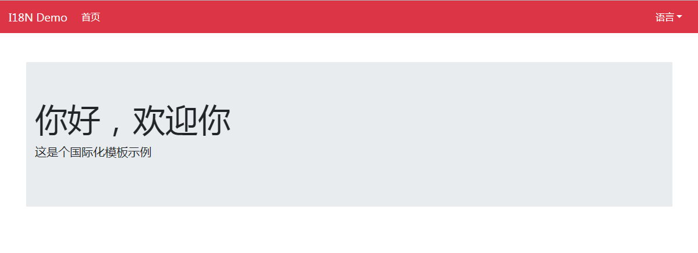
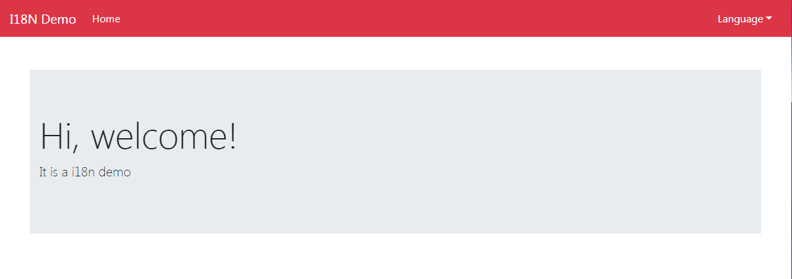

# Spring Boot Thymeleaf 实现国际化

开发传统Java WEB工程时，我们可以使用JSP页面模板语言，但是在SpringBoot中已经不推荐使用了。SpringBoot支持如下页面模板语言

- Thymeleaf
- FreeMarker
- Velocity
- Groovy
- JSP

上面并没有列举所有SpringBoot支持的页面模板技术。其中Thymeleaf是SpringBoot官方所推荐使用的，下面来谈谈Thymeleaf实现应用国际化方法。

    ps：当然现在开发基本上是前后端分离了，但是难免需要维护遗留项目或没有条件前后端分离的团队还是有很多的，这时候学会必要的前端技能，能达到事半功倍的效果。

## 添加Thymeleaf依赖

要想使用Thhymeleaf，首先要在pom.xml文件中单独添加Thymeleaf依赖。

```xml
<dependency>
    <groupId>org.springframework.boot</groupId>
    <artifactId>spring-boot-starter-thymeleaf</artifactId>
</dependency>
```

Spring Boot默认存放模板页面的路径在src/main/resources/templates或者src/main/view/templates，这个无论是使用什么模板语言都一样，当然默认路径是可以自定义的，不过一般不推荐这样做。另外Thymeleaf默认的页面文件后缀是.html

## 什么是国际化

国际化（internationalization）是设计和制造容易适应不同区域要求的产品的一种方式。它要求从产品中抽离所有地域语言，国家/地区和文化相关的元素。换言之，应用程序的功能和代码设计考虑在不同地区运行的需要，其代码简化了不同本地版本的生产。开发这样的程序的过程，就称为国际化。

## Spring Boot Thymeleaf 代码实现国际化

### 1.配置文件代码WebConfiguration.java

```java
package com.easy.templateThymeleaf.config;

import org.springframework.context.annotation.Bean;
import org.springframework.context.annotation.Configuration;
import org.springframework.web.servlet.LocaleResolver;
import org.springframework.web.servlet.config.annotation.InterceptorRegistry;
import org.springframework.web.servlet.config.annotation.WebMvcConfigurer;
import org.springframework.web.servlet.i18n.LocaleChangeInterceptor;
import org.springframework.web.servlet.i18n.SessionLocaleResolver;

import java.util.Locale;

@Configuration
public class WebConfiguration implements WebMvcConfigurer {

    @Bean
    public LocaleResolver localeResolver() {

        SessionLocaleResolver localeResolver = new SessionLocaleResolver();
        localeResolver.setDefaultLocale(new Locale("es", "ES"));
        return localeResolver;
    }

    @Bean
    public LocaleChangeInterceptor localeChangeInterceptor() {

        LocaleChangeInterceptor localeChangeInterceptor = new LocaleChangeInterceptor();
        localeChangeInterceptor.setParamName("lang");
        return localeChangeInterceptor;
    }

    @Override
    public void addInterceptors(InterceptorRegistry registry) {

        registry.addInterceptor(localeChangeInterceptor());
    }
}

```

### 2.控制器代码IndexController.java、LocaleController.java

```java
package com.easy.templateThymeleaf.controller;

import org.springframework.beans.factory.annotation.Autowired;
import org.springframework.context.MessageSource;
import org.springframework.stereotype.Controller;
import org.springframework.ui.Model;
import org.springframework.web.bind.annotation.RequestMapping;
import org.springframework.web.bind.annotation.RequestMethod;

import java.util.Locale;

@Controller
public class IndexController {

    @Autowired
    private MessageSource messageSource;

    @RequestMapping(value = {"/index", "/"}, method = RequestMethod.GET)
    public String index(Model model, Locale locale) {

        model.addAttribute("title", messageSource.getMessage("text.title", null, locale));
        return "index";
    }
}
```

```java
package com.easy.templateThymeleaf.controller;

import org.springframework.stereotype.Controller;
import org.springframework.web.bind.annotation.GetMapping;

import javax.servlet.http.HttpServletRequest;

@Controller
public class LocaleController {

    @GetMapping(value = "/locale")
    public String localeHandler(HttpServletRequest request) {

        String lastUrl = request.getHeader("referer");
        return "redirect:" + lastUrl;
    }
}
```

### 3.静态页面代码index.html

```html
<!DOCTYPE html>
<html xmlns:th="https://www.thymeleaf.org">
<head>
    <meta charset="UTF-8">
    <title th:text="${title}">Insert title here</title>

    <link rel="stylesheet" th:href="@{/css/bootstrap.min.css}">
</head>
<body>

<nav class="navbar navbar-expand-lg navbar-dark bg-danger">
    <a class="navbar-brand" th:href="@{'/'}">I18N Demo</a>
    <button class="navbar-toggler" type="button" data-toggle="collapse" data-target="#navbarNav"
            aria-controls="navbarNav" aria-expanded="false" aria-label="Toggle navigation">
        <span class="navbar-toggler-icon"></span>
    </button>
    <div class="collapse navbar-collapse" id="navbarNav">
        <ul class="navbar-nav mr-auto">
            <li class="nav-item active">
                <a class="nav-link" th:href="@{'/'}" th:text="#{text.home}">Home</a>
            </li>
        </ul>
        <ul class="navbar-nav navbar-right">
            <li class="dropdown">
                <button th:text="#{text.language}" class="btn btn-danger dropdown-toggle" type="button"
                        id="dropdownMenuButton" data-toggle="dropdown" aria-haspopup="true" aria-expanded="false">
                </button>
                <div class="dropdown-menu dropdown-menu-right" aria-labelledby="dropdownMenuButton">
                    <a class="dropdown-item" th:href="@{/locale(lang=es_ES)}"
                       th:text="#{text.language.chinese}">中文</a>
                    <a class="dropdown-item" th:href="@{/locale(lang=en_US)}"
                       th:text="#{text.language.english}">英语</a>
                </div>
            </li>
        </ul>
    </div>
</nav>

<div class="container" style="margin-top:50px">

    <div class="jumbotron jumbotron-fluid">
        <div class="container">
            <h1 class="display-4" th:text="#{text.home.message}">Fluid jumbotron</h1>
            <p class="lead" th:text="#{text.description}">This is a modified jumbotron that occupies the entire
                horizontal space of its parent.</p>
        </div>
    </div>

</div>

<footer>

    <script th:src="@{/js/jquery-3.3.1.min.js}"></script>
    <script th:src="@{/js/popper.min.js}"></script>
    <script th:src="@{/js/bootstrap.min.js}"></script>

</footer>

</body>
</html>
```

### 4.语言配置文件

中文简体语言配置文件messages.properties
```properties
text.title=国际化示例
text.home=首页
text.language=语言
text.language.chinese=中文(简体)
text.language.english=英语
text.home.message=你好，欢迎你
text.description=这是个国际化模板示例
```

英文语言配置文件messages.properties
```properties
text.title=Application title
text.home=Home
text.language=Language
text.language.chinese=Chinese
text.language.english=English
text.home.message=Hi, welcome!
text.description=It is a i18n demo
```

### 5.最后贴上maven配置文件pom.xml

```xml
<?xml version="1.0" encoding="UTF-8"?>
<project xmlns="http://maven.apache.org/POM/4.0.0" xmlns:xsi="http://www.w3.org/2001/XMLSchema-instance"
         xsi:schemaLocation="http://maven.apache.org/POM/4.0.0 http://maven.apache.org/xsd/maven-4.0.0.xsd">
    <modelVersion>4.0.0</modelVersion>
    <parent>
        <groupId>org.springframework.boot</groupId>
        <artifactId>spring-boot-starter-parent</artifactId>
        <version>2.1.9.RELEASE</version>
        <relativePath/> <!-- lookup parent from repository -->
    </parent>
    <groupId>com.easy</groupId>
    <artifactId>template-thymeleaf</artifactId>
    <version>0.0.1</version>
    <name>template-thymeleaf</name>
    <description>Demo project for Spring Boot</description>

    <properties>
        <java.version>1.8</java.version>
        <encoding>UTF-8</encoding>
        <project.build.sourceEncoding>UTF-8</project.build.sourceEncoding>
        <project.reporting.outputEncoding>UTF-8</project.reporting.outputEncoding>
    </properties>

    <dependencies>
        
        <dependency>
            <groupId>com.h2database</groupId>
            <artifactId>h2</artifactId>
            <scope>runtime</scope>
        </dependency>

        <dependency>
            <groupId>org.springframework.boot</groupId>
            <artifactId>spring-boot-starter-thymeleaf</artifactId>
        </dependency>

        <dependency>
            <groupId>org.springframework.boot</groupId>
            <artifactId>spring-boot-starter-web</artifactId>
        </dependency>

        <dependency>
            <groupId>org.springframework.boot</groupId>
            <artifactId>spring-boot-starter-test</artifactId>
            <scope>test</scope>
        </dependency>

        <dependency>
            <groupId>org.projectlombok</groupId>
            <artifactId>lombok</artifactId>
            <optional>true</optional>
        </dependency>

    </dependencies>

    <build>
        <plugins>
            <plugin>
                <groupId>org.springframework.boot</groupId>
                <artifactId>spring-boot-maven-plugin</artifactId>
            </plugin>
        </plugins>
    </build>

</project>

```

## 运行示例

### 1.找到TemplateThymeleafApplication.java文件运行示例

地址栏输入: http://localhost:8080/

### 2.运行效果分别如下

默认为中文语言环境



切换到英文环境后，界面效果如下



## 资料

- [Spring Cloud Feign 示例源码](https://github.com/smltq/spring-boot-demo/blob/master/template-thymeleaf)
- [Spring Boot、Spring Cloud示例学习](https://github.com/smltq/spring-boot-demo)