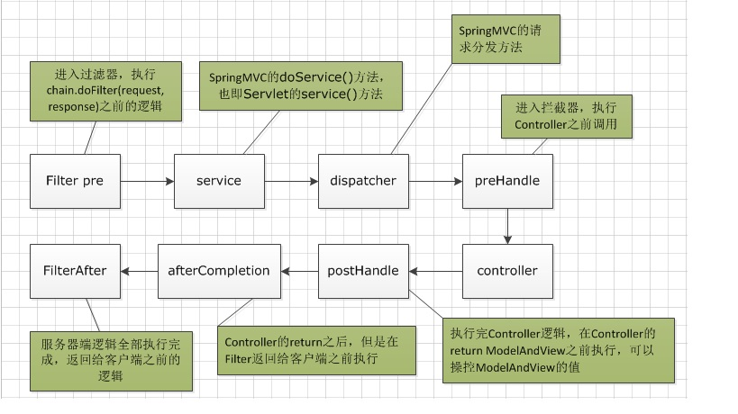

# 基于ssh框架web示例

## 介绍

Spring Boot Web 开发非常简单，该示例包括包括目前web开发基本都需要用到的内容

    - 序列化(json)输出
    - 过滤器(filters)
    - 监视器(listener)
    - 拦截器(interceptor)
    - 日志（基于lombok）
    - properties配置
    - 数据库(mysql)crud
    - ORM
    - 单元测试
    
 等等内容
    
## 示例代码目录介绍
 
 java代码目录规划如下：
    
    com
      +- easy
        +- common
          +- filter
          |  +- CustomFilter.java                   自定义过滤器
          +- interceptor
          |  +- CustomHandlerInterceptor.java       自定义拦截器
          +- listener
          |  +- CustomRequestListener.java          自定义Request监视器
          |  +- CustomSessionListener.java          自定义Session监视器
          +- AppProperties                          项目配置解析类
        +- model                                    model层
          +- repository                             数据访问
          |  +- UserRepository.java
          +- User.java
        +- service                                  服务层
        +- web                                      controller层
          |  +- HelloController.java                入门示例
          |  +- ThymeleafController.java            模块引擎示例
          |  +- UserController.java                 查询用户示例
        +- WebApplication                           启动器
        +- WebConfiguration                         配置入口(配置过滤器、拦截器、监视器）等
          
## 依赖模块引入
  
        <!--Java持久化规范-->
        <dependency>
            <groupId>org.springframework.boot</groupId>
            <artifactId>spring-boot-starter-data-jpa</artifactId>
        </dependency>

        <!--thymeleaf模板引擎-->
        <dependency>
            <groupId>org.springframework.boot</groupId>
            <artifactId>spring-boot-starter-thymeleaf</artifactId>
        </dependency>

        <!--web依赖，包含(包括Tomcat和spring-webmvc)等-->
        <dependency>
            <groupId>org.springframework.boot</groupId>
            <artifactId>spring-boot-starter-web</artifactId>
        </dependency>

        <!--mysql连接驱动-->
        <dependency>
            <groupId>mysql</groupId>
            <artifactId>mysql-connector-java</artifactId>
            <scope>runtime</scope>
        </dependency>

        <!--lombok依赖-->
        <dependency>
            <groupId>org.projectlombok</groupId>
            <artifactId>lombok</artifactId>
            <optional>true</optional>
        </dependency>

        <!--jquery依赖-->
        <dependency>
            <groupId>org.webjars.bower</groupId>
            <artifactId>jquery</artifactId>
            <version>3.4.1</version>
        </dependency>

        <!--bootstrap依赖-->
        <dependency>
            <groupId>org.webjars.bower</groupId>
            <artifactId>bootstrap</artifactId>
            <version>3.3.7</version>
        </dependency>

        <!--单元测试-->
        <dependency>
            <groupId>org.springframework.boot</groupId>
            <artifactId>spring-boot-starter-test</artifactId>
            <scope>test</scope>
        </dependency>
    
## 技术选型

### 后端技术

技术|名称
---|----|
SpringFramework|容器|
Spring Boot|框架容器|
spring-boot-starter-data-jpa|Java持久化规范|
spring-boot-starter-thymeleaf|模板引擎|
spring-boot-starter-web|快速web应用开发|
mysql-connector-java|mysql连接驱动|
lombok|简化java代码|
spring-boot-starter-test|单元测试|

### 前端技术

技术|名称
---|----|
jquery|JavaScript 库|
bootstrap|前端框架|

## 监听器、过滤器、拦截器介绍

### 监听器

    listener是servlet规范中定义的一种特殊类。用于监听servletContext、HttpSession和servletRequest等域对象的创建和销毁事件。监听域对象的属性发生修改的事件。用于在事件发生前、发生后做一些必要的处理。
    
    其主要可用于以下方面：

    - 1、统计在线人数和在线用户
    - 2、系统启动时加载初始化信息
    - 3、统计网站访问量
    - 4、记录用户访问路径。

### 过滤器

    Filter是Servlet技术中最实用的技术，Web开发人员通过Filter技术，对web服务器管理的所有web资源：例如Jsp, Servlet, 静态图片文件或静态 html 文件等进行拦截，从而实现一些特殊的功能。例如实现URL级别的权限访问控制、过滤敏感词汇、压缩响应信息等一些高级功能。它主要用于对用户请求进行预处理，也可以对HttpServletResponse进行后处理。使用Filter的完整流程：Filter对用户请求进行预处理，接着将请求交给Servlet进行处理并生成响应，最后Filter再对服务器响应进行后处理。

### 拦截器

    Interceptor 在AOP（Aspect-Oriented Programming）中用于在某个方法或字段被访问之前，进行拦截然后在之前或之后加入某些操作。比如日志，安全等。一般拦截器方法都是通过动态代理的方式实现。可以通过它来进行权限验证，或者判断用户是否登陆，或者是像12306 判断当前时间是否是购票时间。

### 三大器在springboot中使用时，首先实现相应的接口定义类，然后通过配置类将其加入到spring容器中，从而实现相应的功能。

请求链路过程

## 资料

[示例代码-github](https://github.com/smltq/spring-boot-demo/blob/master/web/HELP.md)